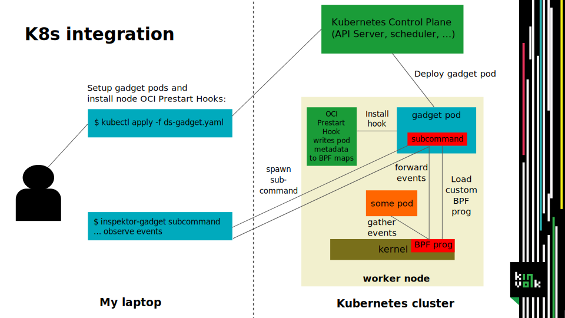
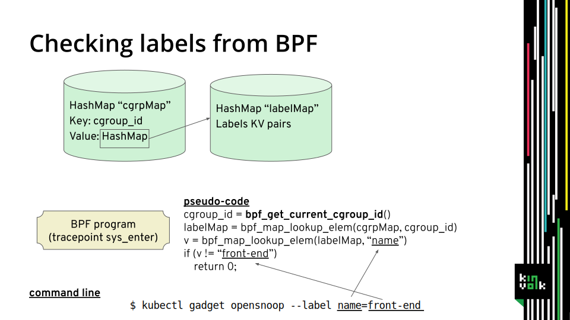

# Inspektor Gadget architecture

Inspektor Gadget is deployed to each node as a privileged DeamonSet.
It uses in-kernel BPF helper programs to monitor events mainly related to
syscalls from userspace programs in a pod. The BPF programs are run by
the kernel and gather the log data. Inspector Gadget's userspace
utilities fetch the log data from ring buffers and display it. What BPF
programs are and how Inspektor Gadget uses them is briefly explained here.

The Linux kernel has an inbuilt virtual machine for BPF bytecode, allowing
userspace to run small scripts in kernel space with limited impact (actually
it is called eBPF to distinguish it from the historical BPF).
The BPF programs are supplied by userspace in a binary format. The kernel
then verifies the program through static analysis, so that no memory corruption
can happen and no out of bounds access can leak sensitive data.
In BPF no loops are allowed and the maximum number of instructions is limited,
so that a BPF program with logical bugs can not hang up the kernel.
Read more on BPF [here](https://lwn.net/Articles/740157/) and [here](http://www.brendangregg.com/ebpf.html).

To trace pods, Inspektor Gadget attaches BPF programs to kernel functions and
the kernel will run them always when the functions are executed. Therefore, the BPF
programs need to detect if the syscall that triggered the function comes from a pod
that Inspektor Gadget should trace. To do that the program looks up the current
cgroup which may correspond to a pod and otherwise exits early.
If only a specific pod should be traced, the program can lookup the labels,
podname, or namespace for this pod and compare it to filter arguments.
Finally, the BPF program gathers the information to trace, e.g., syscall parameters,
and writes them to a ring buffer. Inspektor Gadget's userspace utility listens on
this ring buffer and fetches new events. If the tracing ends, the BPF program
is removed again.

The information of which cgroup belongs to which pod, and the corresponding
namespace, labels, and pod name are available through BPF maps (hash tables).
They are set up and updated by an OCI Prestart Hook.

The execsnoop, opensnoop, tcptop and tcpconnect subcommands use programs
from [bcc](https://github.com/iovisor/bcc) with additional filtering modifications.
They are directly started on the nodes and their output is forwarded to Inspektor Gadget.

Sometimes it is useful to run a BPF program always in the background. It can trace
everything and save it into different ringbuffers per pod.
The userspace utility can then accesses a ring buffer retrospectively only if needed
for introspection or errors. This is currently done for [traceloop](https://github.com/kinvolk/traceloop) (not present in bcc),
which uses an [overwriteable ring buffer](https://lwn.net/Articles/694140/) to only log a small amount of recent events.
It uses a service per each node which provides a Unix Domain Socket accepting HTTP
requests to list the available traces and to dump them (this stops tracing even if the
pod did not already crash).

## Previous talks

- Introducing Flatcar Linux Edge, [Cloud Native Computing Meetup Berlin](https://www.meetup.com/Cloud-Native-Computing-Berlin/events/260143677/) ([slides](https://docs.google.com/presentation/d/1YF7R2b9HHYrcdpz2BuBznpISuVVZsXZEwD8a6SJoDwQ/edit))

