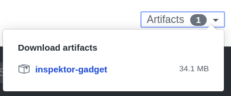

# Installation

## Installation (client side)

Choose one way to install Inspektor Gadget.

### Stable version

```
$ wget https://github.com/kinvolk/inspektor-gadget/releases/download/v0.1.0-alpha.5/inspektor-gadget.tar.gz
$ tar xvf inspektor-gadget.tar.gz
$ sudo cp inspektor-gadget/inspektor-gadget /usr/local/bin/kubectl-gadget
$ kubectl gadget version
```

You can find other releases on [releases](https://github.com/kinvolk/inspektor-gadget/releases).

### Latest version

#### From a specific branch and commit

* Go to the [GitHub Actions page](https://github.com/kinvolk/inspektor-gadget/actions)
* Select one successful build from the desired branch and commit
* Download inspektor-gadget.zip:
  
* Finish the installation:

```
$ unzip -p inspektor-gadget.zip | tar xvzf -
$ sudo cp inspektor-gadget/kubectl-gadget-linux-amd64 /usr/local/bin/kubectl-gadget
$ kubectl gadget version
```

#### From the sources

```
$ git clone https://github.com/kinvolk/inspektor-gadget.git
$ cd inspektor-gadget
$ make kubectl-gadget-linux-amd64
$ sudo cp kubectl-gadget-linux-amd64 /usr/local/bin/kubectl-gadget
$ kubectl gadget version
```

Note:
- the compilation uses `tools/image-tag` to choose the tag of the container
image to use according to the branch that you are compiling.
- you can push the docker images to another registry and use the `--image`
argument to choose them as described below.
- if you wish to make changes to traceloop program, update
`gadget-container/gadget.Dockerfile` to pick your own image of traceloop.
- if you wish to make other changes in the gadget container image, update
`Makefile` to choose the default `gadgetimage`.

See the [minikube](#Development-environment-on-minikube-for-the-traceloop-gadget)
section for a faster development cycle.


## Installation (server side)

### Quick installation

```
$ kubectl gadget deploy | kubectl apply -f -
```

This will deploy the gadget DaemonSet along with its RBAC rules.

### Choosing the gadget image

If you wish to install an alternative gadget image, you could use the following commands:

```
$ kubectl gadget deploy --image=docker.io/myfork/gadget:tag | kubectl apply -f -
```

### runc hooks mode

Inspektor Gadget needs to detect when containers are started and stopped.
The different supported modes can be set by using the `runc-hooks-mode` option:

- `auto`(default): Inspektor Gadget will try to find the best option based on the system it is running on.
- `flatcar_edge`: Use a custom `runc` version shipped with Flatcar Container Linux Edge.
- `ldpreload`: Adds an entry in `/etc/ld.so.preload` to call a custom shared library that looks for `runc` calls and dynamically adds the needed OCI hooks to the cointainer `config.json` specification. Since this feature is highly experimental, it'll not be considered when `auto` is used.

## Getting all gadgets

Not all gadgets currently work everywhere.

| Gadget            | Flatcar Edge | Flatcar Stable | Minikube | GKE |
|-------------------|:------------:|:--------------:|:--------:|:---:|
| traceloop         |       ✔️      |        ✔️       |     ✔️    |  ✔️  |
| network-policy    |       ✔️      |        ✔️       |     ✔️    |  ✔️  |
| tcptracer         |       ✔️      |                |          |     |
| tcpconnect        |       ✔️      |                |          |     |
| tcptop            |       ✔️      |                |          |     |
| execsnoop         |       ✔️      |                |          |     |
| opensnoop         |       ✔️      |                |          |     |
| bindsnoop         |       ✔️      |                |          |     |
| capabilities      |       ✔️      |                |          |     |
| profile           |       ✔️      |                |          |     |

Inspektor Gadget needs some recent Linux features and modifications in Kubernetes present in [Flatcar Container Linux Edge](https://kinvolk.io/blog/2019/05/introducing-the-flatcar-linux-edge-channel/) and [Lokomotive](https://kinvolk.io/blog/2019/05/driving-kubernetes-forward-with-lokomotive/).

### Using Lokomotive on Flatcar Edge

Install your cluster following the [Lokomotive docs](https://github.com/kinvolk/lokomotive#getting-started). To use Flatcar Container Linx edge you should use `os_channel = "edge"` on the configuration file. See [configuration reference](https://github.com/kinvolk/lokomotive/tree/master/docs/configuration-reference/platforms) for more information.

### On another Kubernetes distribution

If you wish to install all the gadgets on another Kubernetes distribution, you will need the following:

- Kubernetes
- Linux >= 4.18 (for [`bpf_get_current_cgroup_id`](https://github.com/iovisor/bcc/blob/master/docs/kernel-versions.md))
- cgroup-v2 enabled in:
  - systemd
    - boot option `systemd.unified_cgroup_hierarchy=false systemd.legacy_systemd_cgroup_controller=false`
  - kubelet
    - `--cgroup-driver=systemd`
  - docker
    - `DOCKER_OPTS="--exec-opt native.cgroupdriver=systemd"`
  - containerd
    - `systemd_cgroup = true` in `$XDG_DATA_DIR/share/containerd/config.toml`
  - runc
- runc recompiled with [additional static OCI hooks](https://github.com/kinvolk/runc/tree/alban/static-hooks)
- The gadget daemon set

## Development environment on minikube for the traceloop gadget

It's possible to make changes to traceloop and test them on minikube locally without pushing container images to any registry.

* Make sure the git repositories `traceloop` and `inspektor-gadget` are cloned in sibling directories
* Minikube with the docker driver does not work for traceloop. You can use another driver, for example:
```
$ minikube start --driver=kvm2
```
* Install Inspektor Gadget on minikube as usual:
```
$ kubectl gadget deploy | kubectl apply -f -
```
* Make changes in the traceloop repository and compile with `make`
* Generate the new gadget image and deploy it to minikube:
```
$ make -C gadget-container/ minikube
```

Note that the minikube image only works with the traceloop gadget.
