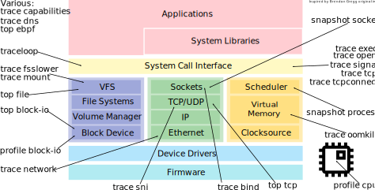
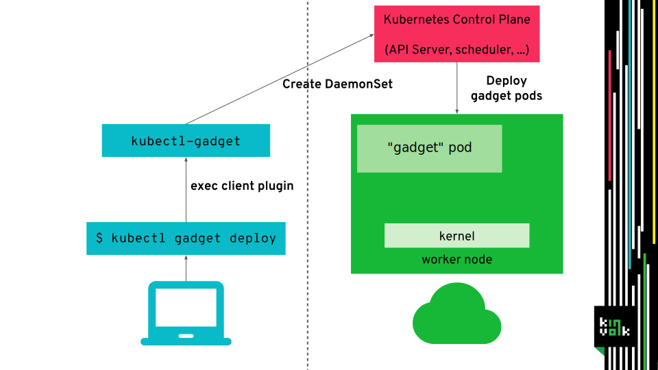
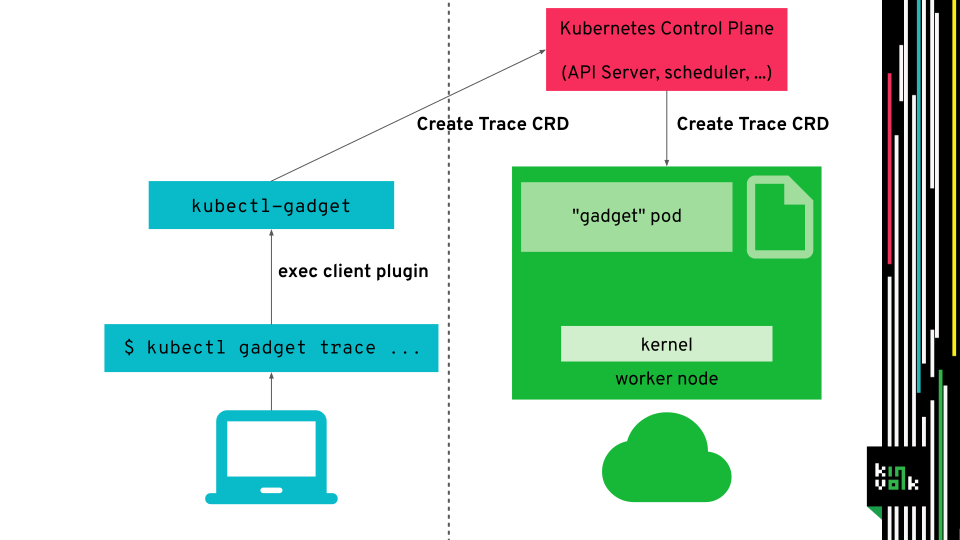

Inspektor Gadget comes with several tools which permit monitoring different
events related to specific kernel subsystems.

It is usually deployed by the `kubectl gadget` plugin. It interacts with the
kube-api server to create all the resources needed for Inspektor Gadget to work.
Another way of deploying Inspektor Gadget is to directly apply the manifests
using `kubectl`.
As a result, Inspektor Gadget is deployed on each node of the cluster as a
`DaemonSet`.

Inspektor Gadget provides a trace Custom Resource Definition (CRD) that is used
to control it. The user interacts with the `kubectl gadget` CLI to create
tracers in the cluster, this CLI uses the kubeapi-server to create create the
corresponding trace CRs on each node. Then, the gadget pod implements a
kubernetes controller that performs the actions indicated in the CR.

This trace CRD is, in turn, used to create tracers which are in charge of
installing eBPF program in the kernel.

The Linux kernel has an inbuilt virtual machine for eBPF bytecode, allowing
userspace to run small scripts in kernel space with limited impact.
The eBPF programs are supplied by userspace in a binary format. The kernel
then verifies the program through static analysis, so that no memory corruption
can happen and no out of bounds access can leak sensitive data.
In eBPF no loops are allowed and the maximum number of instructions is limited,
so that a eBPF program with logical bugs can not hang up the kernel.
Read more on eBPF [here](https://lwn.net/Articles/740157/) and [here](https://www.brendangregg.com/ebpf.html).

To trace pods, Inspektor Gadget attaches eBPF programs to kernel functions and
the kernel will run them always when the functions are executed. Therefore, the
eBPF programs need to detect if the syscall that triggered the function comes
from a pod that Inspektor Gadget should trace. To do that the program looks up
the current `mount` namespace id in a eBPF map containing the list of pods to
trace, if it's not found the program exits early.
Finally, the eBPF program gathers the information to trace, e.g., syscall
parameters, and writes them to a ring buffer or eBPF map.

The events gathered by the eBPF program are written to specific kernel buffers.
The userspace part of Inspektor Gadget reads this events from the buffer and
publishes them to stream.
This stream is displayed on the developer laptop using, internally the
`kubectl exec` API.

The `Gadget Tracer Manager` keeps a list of running gadgets and containers.
Each running gadget has an associated eBPF map that is filled with the `mount`
namespace identifiers of the containers to be traced according to the namespace,
labels, pod name, etc. parameters passed to the gadget.
The `Gadget Tracer Manager` knows about the current running containers thanks to
`runc-fanotify` which adds or removes container to the `Gadget Tracer Manager`
collection.

Sometimes it is useful to run a eBPF program always in the background. It can trace
everything and save it into different ringbuffers per pod.
The userspace utility can then accesses a ring buffer retrospectively only if needed
for introspection or errors. This is currently done for [traceloop](https://github.com/kinvolk/traceloop) (not present in bcc),
which uses an [overwriteable ring buffer](https://lwn.net/Articles/694140/) to only log a small amount of recent events.
It uses a service per each node which provides a Unix Domain Socket accepting HTTP
requests to list the available traces and to dump them (this stops tracing even if the
pod did not already crash).

## `ig`

The job of the [`ig`](ig.md) can be divided into four main
tasks, each of them is managed by the following packages:
- [Tracers](../pkg/gadgets/): They are in charge of collecting events from the
  host, like process creation, file access, etc.
- [Container-Collection](../pkg/container-collection/): It enriches the events
  with the container information (e.g. Kubernetes metadata). To do it, it traces
  the creation and removal of containers in the host.
- [Trace-Collection](../pkg/tracer-collection/): This package is used to filter
  events by containers, using the information provided by the
  Container-Collection package.
- [Columns](../pkg/columns/): It creates a columns representation of the events
  generated by the tracers.

  

We wrote a
[blogpost](https://www.inspektor-gadget.io/blog/2022/09/using-inspektor-gadget-from-golang-applications/)
describing each of this modules, it also provides some examples to test them
together and separately.

## Previous talks

- Introducing Flatcar Container Linux Edge, [Cloud Native Computing Meetup Berlin](https://www.meetup.com/Cloud-Native-Computing-Berlin/events/260143677/) ([slides](https://docs.google.com/presentation/d/1YF7R2b9HHYrcdpz2BuBznpISuVVZsXZEwD8a6SJoDwQ/edit))
