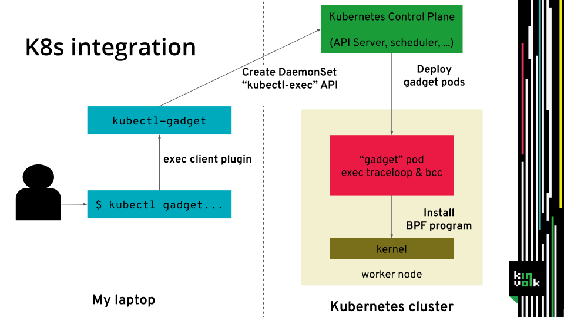
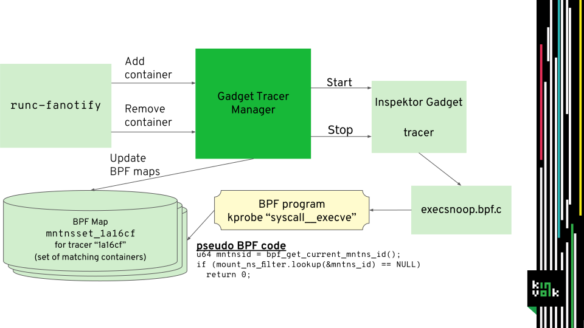

Inspektor Gadget is deployed to each node as a privileged DaemonSet.
It uses in-kernel eBPF helper programs to monitor events mainly related to
syscalls from userspace programs in a pod. The eBPF programs are run by
the kernel and gather the log data. Inspektor Gadget's userspace
utilities fetch the log data from ring buffers and display it. What eBPF
programs are and how Inspektor Gadget uses them is briefly explained here.

The Linux kernel has an inbuilt virtual machine for eBPF bytecode, allowing
userspace to run small scripts in kernel space with limited impact (actually
it is called eBPF to distinguish it from the historical eBPF).
The eBPF programs are supplied by userspace in a binary format. The kernel
then verifies the program through static analysis, so that no memory corruption
can happen and no out of bounds access can leak sensitive data.
In eBPF no loops are allowed and the maximum number of instructions is limited,
so that a eBPF program with logical bugs can not hang up the kernel.
Read more on eBPF [here](https://lwn.net/Articles/740157/) and [here](http://www.brendangregg.com/ebpf.html).

To trace pods, Inspektor Gadget attaches eBPF programs to kernel functions and
the kernel will run them always when the functions are executed. Therefore, the eBPF
programs need to detect if the syscall that triggered the function comes from a pod
that Inspektor Gadget should trace. To do that the program looks up the current
cgroup id in a eBPF map containing the list of pods to trace, if it's not found
the program exits early.
Finally, the eBPF program gathers the information to trace, e.g., syscall parameters,
and writes them to a ring buffer or eBPF map. Inspektor Gadget's userspace utility
listens or reads on this ring buffer or eBPF map and fetches new events.
If the tracing ends, the eBPF program is removed again.

The `Gadget Tracer Manager` keeps a list of running gadgets and containers.
Each running gadget has an associated eBPF map that is filled with the cgroup
ids of the containers to be traced according to the namespace, labels, pod name,
etc. parameters passed to the gadget.
The `Gadget Tracer Manager` also exposes a gRPC interface that is called each
time a container is created or destroyed by the OCI PreStart and PostStop hooks.
It updates the corresponding eBPF maps of each gadget if the container satisfies
the matching criteria.

The execsnoop, opensnoop, tcptop and tcpconnect subcommands use programs
from [bcc](https://github.com/iovisor/bcc) with [special_filtering](https://github.com/iovisor/bcc/blob/master/docs/special_filtering.md).
They are directly started on the nodes and their output is forwarded to Inspektor Gadget.

Sometimes it is useful to run a eBPF program always in the background. It can trace
everything and save it into different ringbuffers per pod.
The userspace utility can then accesses a ring buffer retrospectively only if needed
for introspection or errors. This is currently done for [traceloop](https://github.com/kinvolk/traceloop) (not present in bcc),
which uses an [overwriteable ring buffer](https://lwn.net/Articles/694140/) to only log a small amount of recent events.
It uses a service per each node which provides a Unix Domain Socket accepting HTTP
requests to list the available traces and to dump them (this stops tracing even if the
pod did not already crash).

## Previous talks

- Introducing Flatcar Container Linux Edge, [Cloud Native Computing Meetup Berlin](https://www.meetup.com/Cloud-Native-Computing-Berlin/events/260143677/) ([slides](https://docs.google.com/presentation/d/1YF7R2b9HHYrcdpz2BuBznpISuVVZsXZEwD8a6SJoDwQ/edit))

