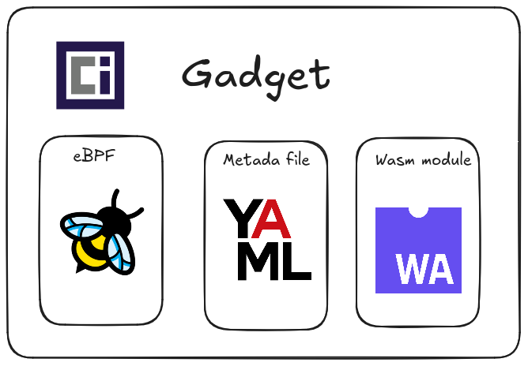
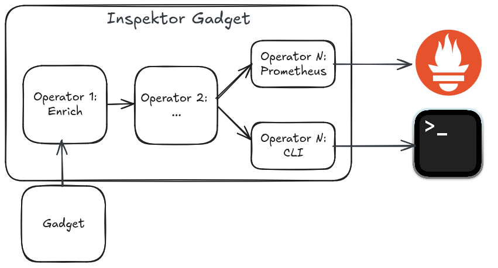

### Gadgets

A Gadget is an [OCI image](https://opencontainers.org/) that includes one or more eBPF programs, metadata YAML file and, optionally, a WASM module for post processing. They are the central component of Inspektor Gadget's framework. As OCI images that use the same tooling as containers and share the same attributes; shareable, modular, etc. Gadgets are built using the `ig image build` command and run with the `ig run`command.

Inspektor Gadget provides a collection of "official-gadgets", (TODO: link), but they can be created by any user. If you are interested in developing your gadget, please check TODO.

> [!WARNING]
> Prior to v0.31.0, Inspektor Gadget shipped gadgets in the binary. As of v0.31.0 these ***built-in*** Gadgets are still available and work as before but their use is discourage as they will be deprecate at some point. We encourage users to use ***image-based*** Gadgets going forward as they provide more features and decouple the eBPF programs from the Inspektor Gadget release process.

### Operators

Operators are a key building block of Inspektor Gadget. They form a pipeline that processes the data coming from gadgets to enrich, filter and export it.

Some operator we have are:
- Kube Manager
- Local Manager
- Formatter
- CLI
- Otel Metrics

#### Enrichment

The data that eBPF collects from the kernel includes no knowledge about Kubernetes, container runtimes or any other high-level user-space concepts. In order to relate this data to these high-level concepts and make the eBPF data immediately more understandable, Inspektor Gadget automatically uses kernel primitives such as mount namespaces, pids, etc. to infer and which high-level concepts they relate to; Kubernetes pods, container names, DNS names, etc. The process of augmenting the eBPF data with these high-level concepts is called enrichment.

#### Filtering

Enrichment flows the other way, too. Inspektor Gadget enables users to do high-performance in-kernel filtering by only referencing high-level concepts such as Kubernetes pods, container names, etc.; automatically translating these to the corresponding low-level kernel resources.

#### Exporting

The data can be exported to different places like the Console, Prometheus, gRPC, etc.
