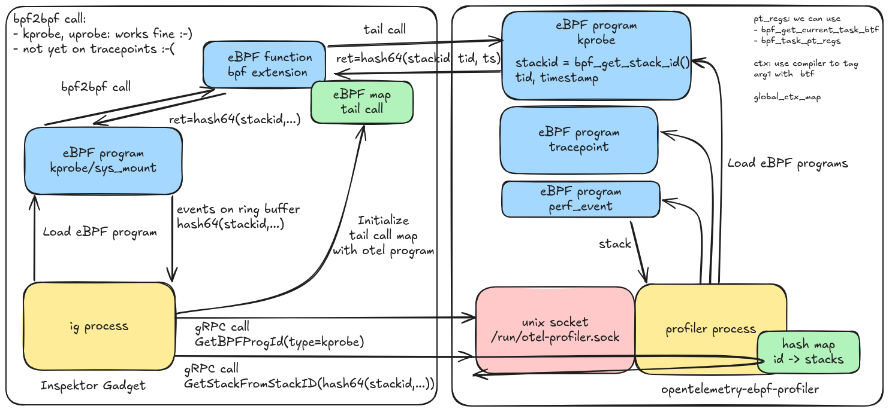

# User stack trace support in Inspektor Gadget

## Previous work in Inspektor Gadget: kernel stack traces

Inspektor Gadget [v0.30.0 (July
2024)](https://github.com/inspektor-gadget/inspektor-gadget/releases/tag/v0.30.0)
added support for **kernel** stack traces in image-based gadgets via
[PR#2671](https://github.com/inspektor-gadget/inspektor-gadget/pull/2671).
Gadget developers can use the [Gadget eBPF
API](https://inspektor-gadget.io/docs/latest/gadget-devel/gadget-ebpf-api#kernel-stack-maps)
that will internally use a `BPF_MAP_TYPE_STACK_TRACE` map and refer to a stack trace
id in events sent via ring buffers.

Each stack trace stored in the `BPF_MAP_TYPE_STACK_TRACE` map can have a depth of
[127
functions](https://github.com/inspektor-gadget/inspektor-gadget/blob/v0.30.0/include/gadget/kernel_stack_map.h#L12).
The map simply stores 127 memory addresses. Looking up the function symbol from
the address is not done in eBPF but in userspace. Inspektor Gadget decodes the
stack using `/proc/kallsyms`.

## Challenges

As opposed to **kernel** stacks, decoding **user** stacks present more challenges:

- Different userspace processes runs different programs, so there is not a
  single source like `/proc/kallsyms` to decode the addresses into symbols.
- The lifetime of a process is shorter than the kernel. If decoding the stack
  is done after the process terminated, the process memory can no longer be
  inspected.
- Programs can be compiled without necessary information to compute the backtrace:
  frame pointers, DWARF, exception-handling frames (`.eh_frame`).
- Interpreted languages don't have a fixed list of symbols to lookup from.

## Two use cases for user stack traces

### Sampling profiler

A sampling profiler works by periodically interrupting the application's
execution (at a rate of 19 or 49 times per second for Parca and bcc
respectively) and recording the current state of the call stack. By analyzing
the frequency of different stack traces, the profiler can identify the
functions and code sections that consume the most CPU time. This information is
valuable for pinpointing performance bottlenecks and optimizing the
application's efficiency.

Examples of profilers:

- [bcc's profile tool in Python](https://github.com/iovisor/bcc/blob/master/tools/profile_example.txt)
- [bcc's profile tool with libbpf and CO-RE](https://github.com/iovisor/bcc/blob/master/libbpf-tools/profile.bpf.c)
- [Inspektor Gadget's builtin profile-cpu gadget](https://www.inspektor-gadget.io/docs/latest/gadgets/builtin/profile/cpu)
- [perf-top](https://man7.org/linux/man-pages/man1/perf-top.1.html)
- [opentelemetry-ebpf-profiler](https://github.com/open-telemetry/opentelemetry-ebpf-profiler)
- [Parca](https://github.com/parca-dev/parca-agent)

Due to the complexities involved in creating a profiler that can effectively
handle a wide range of use cases, there has been a concerted effort by several
companies (Datadog, Elastic, Google, Grafana Labs, Polar Signals, and Red Hat)
to work together within the [OpenTelemetry Profiling
SIG](https://github.com/open-telemetry/community). The main git repository for
this effort is located at
[opentelemetry-ebpf-profiler](https://github.com/open-telemetry/opentelemetry-ebpf-profiler).

You can read more about opentelemetry-ebpf-profiler:
- https://opentelemetry.io/blog/2024/profiling/
- https://opentelemetry.io/blog/2024/elastic-contributes-continuous-profiling-agent/
- https://www.polarsignals.com/blog/posts/2024/08/13/parca-opentelemetry-bright-future

### Enriching events with user stack trace

A lot of gadgets in Inspektor Gadget reports when an application is performing
a specific system call (e.g. the `trace_open` gadget monitors the `open` and
`openat` system calls). This tells **what** an application is doing but not
**why**. To answer the **why** question, it would be useful to show the user
stack trace at the time of the system call.

In this usecase, we're not running a BPF program of type `perf_event` at a
specific frequency but instead we're running a BPF program of type kprobe or
uprobe. But the challenges remain the same and ideally, we would build upon the
work from OpenTelemetry.

## Possible implementations

### Use `BPF_MAP_TYPE_STACK_TRACE` and reimplement stack unwinding

Given the difficulties, Inspektor Gadget would only implement basic support for
programs that include frame pointers.

Pros:
- Work for simple use cases without external dependencies.

Cons:
- In practice, it would not work for most applications without frame pointers.
  It would not work for interpreted languages.

### Integrating opentelemetry-ebpf-profiler as a library

Pros:
- Like Inspektor Gadget, opentelemetry-ebpf-profiler is written in Golang for the
  userspace parts and C for the BPF parts. So it would feel natural to import the
  Go packages in Inspektor Gadget and reuse the BPF code in some way.

Cons:
- opentelemetry-ebpf-profiler is a big project. GitHub pulse shows that inspektor-gadget and
  opentelemetry-ebpf-profiler have a similar amount of authors, commits, line of
  code and stars in the last month.
  - It would significantly increase the size of the ig executable.
  - If several software using this at the same time, the BPF programs would be
    loaded twice, resulting in twice more CPU time being consumed.
- opentelemetry-ebpf-profiler is not designed as a library.

Issue discussing this implementation:
https://github.com/open-telemetry/opentelemetry-ebpf-profiler/issues/33

### gRPC communication between Inspektor Gadget and opentelemetry-ebpf-profiler

When a gadget's BPF code wants to get a user stack trace, it would call a BPF
program prepared by opentelemetry-ebpf-profiler returning a stack trace id.
Then, Inspektor Gadget can request in userspace the details of that stack trace
id.

#### Why gRPC on unix sockets?

Given the need to pass BPF objects between ig and otel-ebpf-profiler, the
communication cannot be between two different computers.

Unix sockets can easily be used between two processes in different pods by
sharing a host volume. File descriptor passing (`SCM_RIGHTS`) is not necessary
because we can pass bpf objects id as an integer and load it with
`bpf(BPF_PROG_GET_FD_BY_ID)` and `bpf(BPF_MAP_GET_FD_BY_ID)`. BPF programs and
maps are not namespaced on Linux, so ig and otel-ebpf-profiler can live in
different containers.

This provide a way to enable/disable the usage of opentelemetry-ebpf-profiler:
if its socket has been made available to ig in
`/run/opentelemetry-ebpf-profiler.sock`, ig would use it. Otherwise, ig would
just report the stack trace without decoding them, or providing a default
implementation.

#### Why adding different BPF program types in opentelemetry-ebpf-profiler?

opentelemetry-ebpf-profiler currently implements BPF programs of type
`perf_event` (`BPF_PROG_TYPE_PERF_EVENT`) in order to run at a specific
frequency for sampling the stack traces. It is not designed to run BPF programs
of type kprobe or uprobe.

As a general framework for BPF, Inspektor Gadget supports different BPF program
types. For networking BPF programs (socket filter, tc, XDP), the user stack
trace feature does not make sense. But for other tracing BPF programs
(tracepoint, kprobe, uprobe), the user stack trace feature is desired.

When a BPF program calls another BPF program (either via tail call or via
bpf2bpf/extension call), the program types need to match. Hence the need for
opentelemetry-ebpf-profiler to duplicate its program in different flavours.

#### Why not a single tail call?

The gadget author needs their code to continue executing after calling the
opentelemetry-ebpf-profiler BPF code. At a minimum, it needs to send the event
on its ring buffer.

#### Why not a BPF extension provided by opentelemetry-ebpf-profiler?

A BPF extension is a program of type `BPF_PROG_TYPE_EXT` declared with freplace.

This is an option, to be defined.

Note that [BPF extensions cannot extend fentry/fexit programs](https://github.com/torvalds/linux/blob/v6.10/kernel/bpf/verifier.c#L21249).
