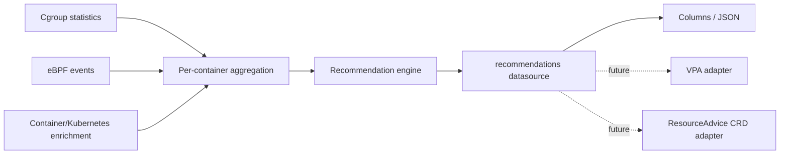

# Plan: Advise Resources Gadget

## Status

This document describes an incremental implementation plan for an
`advise_resources` gadget. The first version is intentionally read-only: it
observes resource usage and kernel signals, calculates container resource
recommendations, and emits structured recommendation events through an
Inspektor Gadget datasource.

Writing recommendations to Kubernetes objects, including VPA
`.status.recommendation`, is out of scope for the first version. The event
contract should nevertheless make such integrations possible without changing
the collection or recommendation algorithm.

## Goals

- Recommend CPU and memory requests for individual containers.
- Combine resource usage with kernel-level pressure and failure signals.
- Work as a normal gadget on Kubernetes and standalone Linux hosts.
- Emit machine-readable records through the standard gadget output pipeline.
- Explain recommendations with confidence, observations, and reason codes.
- Keep the initial implementation read-only and free of Kubernetes write
  permissions.
- Establish a stable boundary between signal collection, recommendation logic,
  and future delivery adapters.

## Non-goals for the first version

- Mutating Pod requests or limits.
- Writing VPA status, annotations, ConfigMaps, or custom resources.
- Replacing the VPA recommender.
- Guaranteeing recommendations from short observation windows.
- Predicting workload changes that were not represented during observation.
- Recommending GPU, ephemeral storage, or extended resources.
- Providing a long-term metrics storage system.

## User experience

The gadget should periodically emit one record per observed container:

```console
$ kubectl gadget run advise_resources:latest \
    --namespace demo \
    --param period=1m \
    --param min-observation-window=15m

NAMESPACE  POD          CONTAINER  CPU REC  MEM REC  CONFIDENCE  REASONS
demo       web-7dc9f8   web        450m     384Mi    0.82        cpu-pressure,cpu-throttling
```

JSON output should expose the complete recommendation and its supporting
observations. Column output should contain only the fields needed for an
operator to quickly understand the result.

The gadget should emit:

1. Periodic recommendations after the minimum observation window.
2. A recommendation when the calculated value changes materially.
3. A final recommendation when the gadget stops.

It should not emit a new record for insignificant fluctuations. A default
change threshold of 10 percent is a reasonable starting point.

## Event contract

The output should use a dedicated `recommendations` datasource with one record
per container. The initial schema should be versioned so consumers can safely
depend on it.

| Field | Type | Description |
|---|---|---|
| `schemaVersion` | string | Event schema version, initially `v1alpha1`. |
| `timestamp` | timestamp | Time at which the recommendation was calculated. |
| `windowStart` | timestamp | Beginning of the observation window. |
| `windowEnd` | timestamp | End of the observation window. |
| `algorithm` | string | Algorithm identifier and version. |
| `k8s.namespace` | string | Kubernetes namespace when available. |
| `k8s.podName` | string | Pod name when available. |
| `k8s.containerName` | string | Kubernetes container name when available. |
| `runtime.containerName` | string | Runtime container name when available. |
| `runtime.containerId` | string | Runtime container ID when available. |
| `cgroupId` | uint64 | Stable identity used while collecting signals. |
| `current.cpuRequest` | quantity | Current CPU request when available. |
| `current.memoryRequest` | quantity | Current memory request when available. |
| `current.cpuLimit` | quantity | Current CPU limit when available. |
| `current.memoryLimit` | quantity | Current memory limit when available. |
| `observed.cpuP50` | quantity | Median observed CPU consumption. |
| `observed.cpuP90` | quantity | 90th percentile observed CPU consumption. |
| `observed.memoryP50` | quantity | Median interval memory peak. |
| `observed.memoryP90` | quantity | 90th percentile interval memory peak. |
| `signals.cpuThrottleRatio` | float | Fraction of CPU periods throttled. |
| `signals.cpuPressureAvg10` | float | Cgroup CPU PSI `some avg10`, when available. |
| `signals.cpuPressureAvg60` | float | Cgroup CPU PSI `some avg60`, when available. |
| `signals.oomKills` | uint64 | OOM kills observed during the window. |
| `signals.memoryHighEvents` | uint64 | `memory.high` events during the window. |
| `signals.memoryOOMEvents` | uint64 | Cgroup memory OOM events during the window. |
| `recommended.cpuRequest` | quantity | Recommended CPU request. |
| `recommended.memoryRequest` | quantity | Recommended memory request. |
| `lowerBound.cpu` | quantity | Conservative lower CPU bound. |
| `lowerBound.memory` | quantity | Conservative lower memory bound. |
| `upperBound.cpu` | quantity | Conservative upper CPU bound. |
| `upperBound.memory` | quantity | Conservative upper memory bound. |
| `confidence` | float | Value from 0 to 1 describing evidence maturity. |
| `reasons` | string | Stable comma-separated reason codes. |

Request fields must be optional. Cgroups expose resource consumption and
limits, but not Kubernetes requests. Kubernetes enrichment can populate
requests when the runtime has access to Pod specifications; standalone mode
must still produce useful absolute recommendations without them.

Stable reason codes should be used instead of free-form explanations. Initial
codes can include:

- `cpu-usage`
- `cpu-pressure`
- `cpu-throttling`
- `memory-working-set`
- `memory-pressure`
- `memory-high`
- `oom-kill`
- `insufficient-history`
- `request-data-unavailable`

## Proposed architecture



### Collection layer

The collection layer should use cgroup ID as its internal key and enrich the
result with container metadata before emission.

The first implementation should collect from cgroup v2:

- CPU usage deltas from `cpu.stat`.
- Throttling periods and time from `cpu.stat`.
- CPU quota and period from `cpu.max`.
- CPU pressure from `cpu.pressure`.
- Current and peak memory from `memory.current` and `memory.peak`.
- Memory limits from `memory.max` and `memory.high`.
- OOM and pressure counters from `memory.events`.

The existing cgroup operator already provides CPU throttling, quota, and CPU
PSI fields for `top_cpu_throttle`. It should be reused or extended rather than
implementing a second cgroup filesystem reader.

eBPF should be reserved for signals that cannot be reliably obtained from
periodic cgroup files, initially:

- OOM kill attribution and timing.
- Optional scheduler latency or reclaim latency in later iterations.

Avoid collecting the same signal through both cgroup files and eBPF unless the
two sources have clearly different semantics.

### Extended signal model

Resource usage says what a container consumed, but not whether it received all
the resources it needed or why it was delayed. Additional kernel signals can
validate a recommendation and distinguish container undersizing from node-wide
contention.

| Signal | Primary interpretation | Recommendation use |
|---|---|---|
| CFS throttling | Container exhausted its CPU limit. | Strong evidence that the CPU limit is restrictive; not proof by itself that the request is too low. |
| CPU PSI | Runnable work could not obtain CPU time. | Evidence of CPU starvation with or without CPU limits. |
| Run-queue latency | Delay from `sched_wakeup` to `sched_switch`. | Tail-latency evidence that a container wanted CPU but had to wait. |
| Node CPU PSI | CPU contention affects the whole node. | Reduces attribution to one container and may indicate a node-capacity problem. |
| CPU steal time | The virtual machine lost CPU time to the hypervisor. | Marks the observation window as environmentally contaminated. |
| Memory PSI | Work stalled due to memory reclaim. | Strong evidence that the available working set is insufficient. |
| Direct reclaim latency | Application threads stalled while reclaiming memory. | Supports increasing memory headroom when attributed to the container. |
| Workingset refaults | Recently reclaimed pages were needed again. | Indicates that the useful working set does not fit. |
| `memory.high` events | The cgroup crossed its soft memory boundary. | Early warning before an OOM. |
| OOM kills | The memory limit caused a hard failure. | Establishes a hard lower bound for memory recommendations. |
| Major faults and swap | Memory had to be retrieved from storage. | Supporting evidence; startup and cold-cache effects must be excluded. |
| Node memory PSI, reclaim, or compaction | The node as a whole is short of memory. | Attribution and node-health evidence, not a direct reason to increase every Pod request. |
| I/O PSI and block latency | Work is blocked on storage rather than CPU. | Prevents CPU wait from being misdiagnosed as CPU undersizing. |

Per-container run-queue latency is a useful eBPF-specific addition. It can be
measured by recording when a task becomes runnable at `sched_wakeup` and
calculating the delay when that task is selected at `sched_switch`. Histograms
should be aggregated by cgroup ID.

CPU utilization and run-queue latency answer different questions:

```text
CPU utilization: How much CPU did the container receive?
Run-queue latency: How long did it want CPU but fail to receive it?
```

The signals must be interpreted together:

- High run-queue latency, high throttling, and low node CPU pressure usually
  indicate a restrictive container CPU limit.
- High run-queue latency, usage above the request, and high node CPU pressure
  indicate that the request may be too low to obtain an adequate CPU share.
- High run-queue latency across most containers indicates node saturation;
  increasing every Pod request will not create capacity.
- High utilization with low run-queue latency describes a busy workload, but
  does not by itself demonstrate CPU starvation.

Memory pressure requires the same attribution discipline:

```text
Container pressure + healthy node   -> high attribution to container sizing
Container pressure + pressured node -> mixed container and node problem
No container pressure + pressured node -> node/noisy-neighbor problem
No container pressure + healthy node   -> normal observation
```

The recommendation engine should distinguish anonymous memory from file cache
where possible. File cache can be reclaimable, although repeated workingset
refaults can demonstrate that the cache remains performance-critical.

Most cgroup statistics and PSI values do not require eBPF and should continue
to come from cgroup v2. eBPF is most useful for precise attribution and latency
histograms such as run-queue delay, direct reclaim stalls, OOM events, and
major-fault latency.

### Aggregation layer

Maintain bounded per-cgroup state containing:

- Exponentially weighted CPU usage histogram.
- Memory peak histogram.
- Observation start and last sample timestamps.
- Sample count and missed-sample count.
- Accumulated pressure, throttling, and OOM counters.
- Last emitted recommendation.
- Container identity and enrichment metadata.

State should be deleted when its cgroup disappears. Hard limits on tracked
cgroups and histogram size are required to prevent unbounded memory growth.

For the first version, state only needs to live for the duration of the gadget
run. Checkpointing and historical metric providers can be considered later.

### Recommendation layer

Start with a transparent percentile algorithm inspired by VPA, without trying
to reproduce VPA exactly:

```text
cpuBase    = weightedP90(cpuUsage)
memoryBase = weightedP90(intervalMemoryPeaks)

cpuRecommendation    = cpuBase * cpuSafetyMargin
memoryRecommendation = memoryBase * memorySafetyMargin
```

Suggested initial defaults:

| Parameter | Default |
|---|---|
| Recommendation period | 1 minute |
| Minimum observation window | 15 minutes |
| CPU histogram half-life | 30 minutes |
| Memory peak interval | 1 minute |
| CPU percentile | 90 |
| Memory percentile | 90 |
| CPU safety margin | 15 percent |
| Memory safety margin | 15 percent |
| Material change threshold | 10 percent |

These defaults are suitable for interactive observation, not long-term
capacity planning. They must be configurable and clearly reported in the
algorithm identifier.

Kernel signals should modify or qualify the base recommendation using explicit,
testable rules:

- Increase CPU headroom when sustained throttling or CPU pressure is observed.
- Never interpret throttling as proof that the CPU request is too low when only
  a CPU limit is known; report the signal and lower confidence instead.
- Raise the memory recommendation after an attributed OOM to at least the
  observed/requested level plus a configurable bump.
- Increase memory headroom when repeated `memory.high` events are observed.
- Do not lower memory recommendations during a window containing an OOM.
- Mark recommendations as low confidence when the observation window or sample
  count is insufficient.

Every adjustment must add a stable reason code and be covered by unit tests.
Avoid a single opaque score that makes it impossible to explain why a value
changed.

### Confidence

Confidence should describe the maturity and quality of the evidence, not how
strongly the gadget prefers a recommendation. Internally, it should remain
multidimensional:

- **Coverage:** Fraction of the requested observation window completed and the
  number and regularity of samples.
- **Stability:** Whether percentiles are stable or the workload is undergoing
  startup, deployment, or traffic transitions.
- **Attribution:** Whether pressure is local to the container or caused by
  node-wide saturation, noisy neighbors, steal time, or storage stalls.
- **Signal agreement:** Whether usage, throttling, pressure, reclaim, and
  failures point in the same direction.
- **Representativeness:** Whether the observation included realistic traffic,
  replica counts, and workload phases.
- **Metadata quality:** Availability of request, limit, workload, and
  container-identity information.

The exact formula should be documented and deterministic. Recommendations may
still be emitted below the confidence threshold, but they should include
`insufficient-history`.

An overall confidence value can be emitted for convenience, but the components
should be retained in the internal model and added to the event schema when the
contract can support them. Pressure signals can increase confidence in the
direction of a recommendation while node-wide interference decreases
confidence that changing this particular container will solve the problem.

Examples:

- CPU P90 above the request together with sustained run-queue latency and
  throttling gives high confidence in increasing CPU.
- Low CPU usage measured during high node PSI or steal time gives low
  confidence in decreasing CPU.
- High `memory.current` dominated by file cache, without refaults or memory
  PSI, gives low confidence in increasing memory.
- An OOM together with `memory.high` events and direct reclaim gives high
  confidence that memory is insufficient.

### Industry context

ScaleOps does not publish its recommendation formula, model features, or
feature weights. Its public material says that it combines historical and live
resource usage with workload and cluster context. Publicly described inputs
include:

- CPU throttling and per-container PSI.
- Memory working set and OOM risk.
- Node health, noisy neighbors, and Kubernetes events.
- Startup and burst behavior.
- Workload classifications such as stateless, stateful, batch, and JVM.
- HPA, KEDA, replica, and placement context.
- Learned traffic patterns, policies, and safety constraints.

This provides useful validation for combining usage with pressure and
attribution signals, but does not imply that those signals are collected with
eBPF or reveal how ScaleOps scores them. Many are already available from
cgroup v2, kubelet, cAdvisor, and Kubernetes APIs.

The `advise_resources` design should remain explainable rather than attempting
to reproduce a proprietary model. Its differentiator can be showing whether a
container was demonstrably suffering and whether that suffering originated
inside the container or from the node.

References:

- [ScaleOps: Kubernetes leading scaling metrics](https://scaleops.com/blog/blog-kubernetes-leading-scaling-metrics/)
- [ScaleOps: automated Pod rightsizing](https://scaleops.com/product/automated-pod-rightsizing/)

## Implementation phases

### Phase 1: Structured recommendation events

- Add `gadgets/advise_resources/`.
- Define `gadget.yaml`, documentation, build configuration, and artifact
  metadata.
- Add a `recommendations` datasource with the versioned schema.
- Reuse the cgroup operator for throttling, quota, and CPU PSI.
- Extend the cgroup datasource with CPU usage and memory statistics needed by
  the recommendation engine.
- Implement in-run aggregation and percentile calculations in a gadget WASM
  module.
- Emit periodic, material-change, and final recommendation records.
- Support both Kubernetes and standalone container enrichment.
- Treat Kubernetes request data as optional.

### Phase 2: Additional eBPF signals

- Attribute OOM kills to the affected cgroup/container.
- Correlate OOM events with memory observations.
- Add configurable OOM bump logic and reason codes.
- Add per-cgroup run-queue latency histograms based on scheduler wakeup and
  switch events.
- Evaluate direct reclaim latency, workingset refaults, and major-fault
  latency.
- Correlate container-local pressure with node CPU, memory, and I/O pressure.
- Add only signals that materially improve recommendation quality.

### Phase 3: Recommendation quality

- Compare output against controlled CPU-bound, memory-bound, bursty, and idle
  workloads.
- Add confidence calibration and stability tests.
- Add hysteresis to prevent recommendation oscillation.
- Distinguish startup behavior from steady-state behavior.
- Evaluate longer observation windows and optional persisted history.

### Phase 4: Optional delivery adapters

- Define an IG-specific `ResourceAdvice` CRD if detailed recommendations need
  durable cluster storage.
- Build a separate controller that consumes recommendation records and writes
  the CRD.
- Optionally add a VPA adapter that projects CPU and memory target/lower/upper
  values into `.status.recommendation`.
- Keep Kubernetes write RBAC in the adapter, not in the gadget.
- Require a named VPA recommender to avoid competing with the default
  recommender.

## Parameters

The initial gadget should expose:

| Parameter | Purpose |
|---|---|
| `period` | Recommendation emission interval. |
| `min-observation-window` | Minimum time before a mature recommendation. |
| `cpu-percentile` | CPU usage percentile used as the base. |
| `memory-percentile` | Memory peak percentile used as the base. |
| `cpu-safety-margin` | Additional CPU headroom. |
| `memory-safety-margin` | Additional memory headroom. |
| `histogram-half-life` | Weight decay for older observations. |
| `memory-peak-interval` | Interval over which memory peaks are calculated. |
| `change-threshold` | Minimum relative change before emitting early. |
| `min-confidence` | Threshold for marking a recommendation mature. |
| `oom-bump-ratio` | Relative memory increase after an OOM. |
| `oom-min-bump` | Minimum absolute memory increase after an OOM. |

Parameter names should follow existing gadget conventions and duration or
quantity parsing should use shared helpers where available.

## Testing strategy

### Unit tests

- Histogram decay and percentile selection.
- Safety margins and rounding.
- Confidence calculation.
- Material-change detection and hysteresis.
- OOM and pressure adjustments.
- Missing request or limit metadata.
- Counter resets caused by cgroup recreation.
- Cleanup of expired container state.
- Deterministic reason-code ordering.

### Integration tests

- CPU-bound container without throttling.
- CPU-bound container constrained by a CPU limit.
- Bursty CPU workload.
- Stable memory workload.
- Growing memory workload.
- Container terminated by an OOM kill.
- Multiple replicas of the same workload.
- Container restart and cgroup replacement.
- Kubernetes enrichment and standalone runtime enrichment.

Integration tests should assert measurable ranges rather than exact quantities
when scheduler timing or kernel accounting can introduce variation.

### Compatibility tests

- Cgroup v2 with all expected files.
- Missing PSI or `memory.peak` files.
- Unlimited CPU or memory values.
- Kubernetes and non-Kubernetes execution.
- JSON schema stability for datasource consumers.

## Safety and operational constraints

- The gadget must not mutate workloads or Kubernetes resources.
- Missing signals must be represented explicitly, not converted to zero values
  that look like valid observations.
- Recommendation calculations must use overflow-safe units and duration
  arithmetic.
- Per-container state and eBPF maps must have explicit size limits.
- Output must identify low-confidence and incomplete observations.
- Recommendations should not be described as guaranteed-safe resource values.

## Initial completion criteria

The first version is complete when it can:

1. Run for a configurable observation window.
2. Track CPU usage, memory usage, throttling, and CPU PSI per container.
3. Emit absolute CPU and memory request recommendations.
4. Include lower and upper bounds, confidence, and reason codes.
5. Work without Kubernetes write permissions.
6. Produce useful JSON in Kubernetes and standalone runtime modes.
7. Pass unit tests for the recommendation algorithm and integration tests for
   representative CPU and memory workloads.

## Decisions to revisit

- Whether cgroup statistics should be added to the existing cgroup operator or
  exposed by a smaller reusable statistics datasource.
- Whether the recommendation engine belongs in gadget WASM or a reusable core
  data operator once more advisors need it.
- How Kubernetes Pod requests should be exposed through enrichment without
  coupling the gadget to the Kubernetes API.
- Whether recommendations should be per container instance only or optionally
  aggregated by workload/controller.
- Which signal adjustments improve accuracy enough to justify their runtime
  cost.
- Whether a future durable API should use VPA status directly or an IG-specific
  CRD with a VPA adapter.
