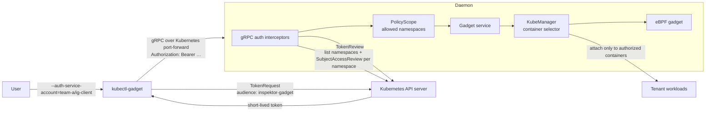

# Kubernetes multi-tenancy

## Status

Kubernetes multi-tenancy is an experimental, opt-in mode. It authenticates
each `kubectl-gadget` request through Kubernetes and restricts gadgets to the
namespaces authorized for that identity.

The current identity is an audience-scoped ServiceAccount token minted by
`kubectl-gadget`. This avoids forwarding the user's reusable kubeconfig
credential to the privileged gadget pod.

## Security model

Inspektor Gadget has node-wide visibility. Client-side filters are therefore
not a security boundary: a modified client could remove them. Multi-tenancy
enforces these invariants in the gadget service:

- every gRPC request requires a token for the `inspektor-gadget` audience;
- Kubernetes `TokenReview` authenticates the token;
- Kubernetes `SubjectAccessReview` resolves namespace access;
- the KubeManager container selector is narrowed before the gadget starts;
- namespace exclusions and unsupported, host-wide gadgets are rejected;
- detached instances are filtered and authorized on create, inspect, list,
  attach, and delete.

Users with access to the same namespace share its security boundary. This mode
does not provide per-user ownership inside a namespace.

## Architecture



### 1. Token minting

`kubectl-gadget` calls the Kubernetes `TokenRequest` subresource for the
ServiceAccount selected by `--auth-service-account=<namespace>/<name>`. The
requested token:

- has audience `inspektor-gadget`;
- defaults to a one-hour lifetime, configurable with
  `--auth-token-expiration`;
- remains in memory;
- is attached to each gRPC call.

The caller must have `create` access to
`serviceaccounts/token` in that namespace. Kubernetes rejects the command
before it reaches Inspektor Gadget otherwise.

The credential is allowed over the clear-text inner gRPC connection only when
the runtime uses Kubernetes port-forward. That inner connection is carried
inside the authenticated, encrypted Kubernetes API connection. Direct gRPC
connections do not receive this exception.

### 2. Authentication

Unary and stream interceptors extract the bearer token and submit a
`TokenReview` with the expected audience. Missing, invalid, or wrong-audience
tokens fail with `Unauthenticated`.

The audience restriction is important: the token is intended for Inspektor
Gadget and cannot be replayed as a normal Kubernetes API credential.

### 3. Namespace authorization

After authentication, the daemon lists namespaces and submits a
`SubjectAccessReview` for the authenticated ServiceAccount in each namespace.
By default it asks:

```yaml
apiGroup: ""
resource: pods
verb: create
```

The resulting namespace list is stored in the request context. Authentication
or authorization API failures fail the request closed.

The checked resource is configurable because installations may want a
dedicated observability permission instead of granting `create pods`.
The resource need not have a CRD for Kubernetes RBAC to evaluate a
`SubjectAccessReview`.

### 4. Gadget enforcement

KubeManager is the existing server-side boundary that selects containers for
a gadget. Multi-tenancy reuses it instead of adding a second event filter:

| Request | Enforcement |
| --- | --- |
| one namespace | accepted only when authorized |
| comma-separated namespaces | every namespace must be authorized |
| `--all-namespaces` | replaced with the complete authorized namespace list |
| exclusion such as `!team-b` | rejected because it could include unauthorized namespaces |
| no namespace | treated as `default` |
| gadget without KubeManager isolation | rejected |

The constrained values are copied into KubeManager before it creates mount
namespace maps or attaches probes. Unauthorized containers are therefore
excluded before data collection, not merely hidden at output time.

### 5. Detached instances

Creation persists the already-constrained namespace values. Subsequent
operations authorize those values against the caller's current policy scope:

- list hides instances outside the caller's namespaces;
- inspect, attach, and delete reject unauthorized instances;
- permission changes affect the next RPC;
- an established stream keeps the scope resolved when it was opened.

## Deployment

### Helm

```sh
helm upgrade --install gadget ./charts/gadget \
  --namespace gadget --create-namespace \
  --set experimental.multiTenancy.enabled=true
```

The chart enables the daemon setting and binds its ServiceAccount to the
built-in `system:auth-delegator` ClusterRole, which grants both `TokenReview`
and `SubjectAccessReview`.

To use a dedicated authorization permission:

```sh
helm upgrade --install gadget ./charts/gadget \
  --namespace gadget --create-namespace \
  --set experimental.multiTenancy.enabled=true \
  --set experimental.multiTenancy.scope.apiGroup=gadget.kinvolk.io \
  --set experimental.multiTenancy.scope.resource=traces \
  --set experimental.multiTenancy.scope.verb=get
```

### `kubectl-gadget deploy`

The embedded default manifest does not grant delegated authentication
permissions while the feature is disabled. When enabling it through daemon
configuration, add the binding explicitly:

```sh
kubectl gadget deploy \
  --set-daemon-config=multi-tenancy=true

kubectl create clusterrolebinding gadget-auth-delegator \
  --clusterrole=system:auth-delegator \
  --serviceaccount=gadget:gadget
```

## Tenant setup

Create a dedicated identity and grant it the permission used by the configured
scope:

```yaml
apiVersion: v1
kind: ServiceAccount
metadata:
  name: ig-client
  namespace: team-a
---
apiVersion: rbac.authorization.k8s.io/v1
kind: Role
metadata:
  name: ig-tenant
  namespace: team-a
rules:
  - apiGroups: [""]
    resources: ["pods"]
    verbs: ["create"]
---
apiVersion: rbac.authorization.k8s.io/v1
kind: RoleBinding
metadata:
  name: ig-tenant
  namespace: team-a
roleRef:
  apiGroup: rbac.authorization.k8s.io
  kind: Role
  name: ig-tenant
subjects:
  - kind: ServiceAccount
    name: ig-client
    namespace: team-a
```

Separately grant the human or automation running `kubectl-gadget` permission
to create a token for the selected ServiceAccount.

Run a gadget:

```sh
kubectl gadget \
  --auth-service-account=team-a/ig-client \
  run ghcr.io/inspektor-gadget/gadget/trace_exec:latest \
  --namespace team-a
```

## Known limits

- Each RPC performs one `TokenReview`, one namespace list, and one
  `SubjectAccessReview` per namespace. Add a short-lived cache only when API
  server load is measurable.
- Authorization is resolved when a stream opens; long-running streams are not
  reauthorized until reconnect.
- The default `create pods` policy couples gadget access to workload creation.
  Configure a dedicated resource when that distinction matters.
- Isolation currently requires KubeManager-compatible gadgets. Host-wide or
  non-namespaced data is denied rather than guessed.
- Authenticated callers can request metadata for arbitrary gadget images.
  Image verification and registry policy, not namespace RBAC, define which
  images are trusted.
- Tenants in the same namespace can access the same detached instances.
  Add creator ownership only if namespace-level tenancy is insufficient.
