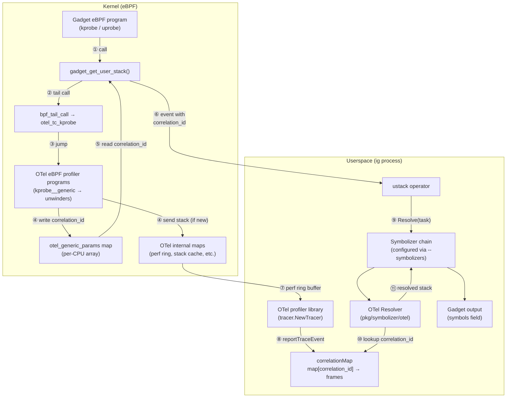
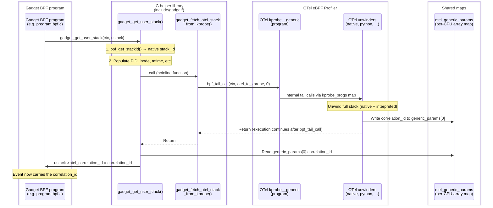
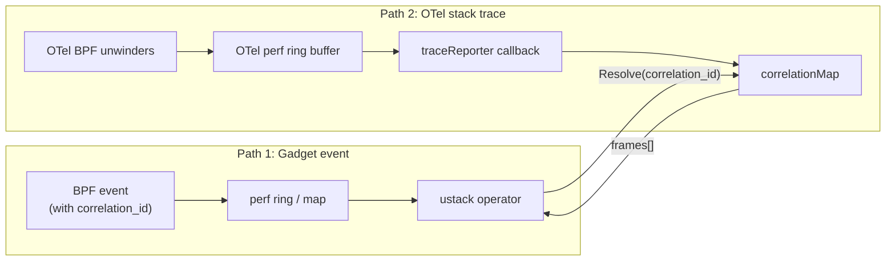
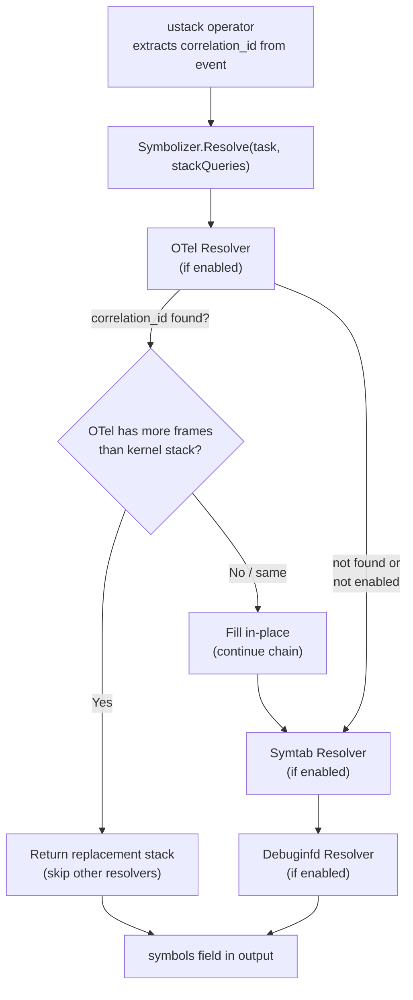
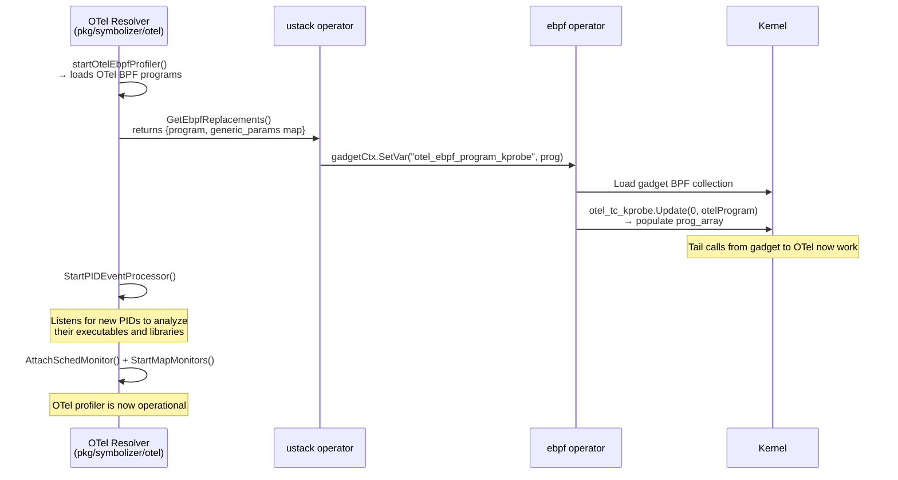

# Architecture: Inspektor Gadget with OTel eBPF Profiler

## Overview

Inspektor Gadget (IG) integrates
[otel-ebpf-profiler](https://github.com/open-telemetry/opentelemetry-ebpf-profiler)
as a library to resolve user-space stacks for interpreted languages (Python,
Ruby, etc.) and runtimes that the kernel's `bpf_get_stackid()` cannot unwind
on its own.

The kernel's native BPF stack unwinder only sees the C-level frames of the
interpreter (e.g. two CPython frames), while otel-ebpf-profiler can
reconstruct the full interpreted stack (e.g. 20 Python frames with function
names, file paths, and line numbers).

## High-Level Architecture



## Event Flow: Step by Step

### 1. BPF Side: From Gadget to OTel and Back

When a gadget's eBPF program fires (kprobe, uprobe), it calls
`gadget_get_user_stack(ctx, ustack)` to capture the user stack. If
`--collect-otel-stack=true`, the following sequence runs:



**Key mechanism**: `gadget_fetch_otel_stack_from_kprobe()` is marked
`__attribute__((noinline))`. When it calls `bpf_tail_call()`, the OTel program
runs and returns. Execution continues after the tail call, where
`gadget_get_user_stack()` reads the `correlation_id` from
`otel_generic_params` (a per-CPU array map shared between the gadget and OTel).

### 2. Two Independent Paths to Userspace

The correlation_id bridges two independent data paths:



**Path 1** (gadget data): The gadget event carries the `correlation_id` and
arrives in the ustack operator for symbolization.

**Path 2** (OTel data): The OTel BPF code checks the
`stack_cache2correlation_id` BPF hash map to see if this stack was already
seen. If the stack is new, it assigns a fresh `correlation_id` (from
`bpf_ktime_get_ns()`), caches it, and sends the full trace to userspace via
the OTel perf ring buffer. If the stack was already seen, it reuses the
existing `correlation_id` without sending anything to userspace.
(See `support/ebpf/interpreter_dispatcher.ebpf.c`, function `unwind_stop`.)

In userspace, the `traceReporter` callback stores the frames in
`correlationMap[id]`.

When the ustack operator calls `Resolve()`, the OTel resolver looks up the
`correlation_id` in the `correlationMap` to retrieve the full stack.

### 3. Userspace: Symbolizer Chain

Which resolvers are active depends on the `--symbolizers` CLI option.
Possible values: `none`, `auto`, or a comma-separated list from: `symtab`,
`debuginfod-cache`, `debuginfod-cache-on-ig-server`, `otel-ebpf-profiler`.

Each resolver is registered with a priority (lower = runs first). When
enabled, resolvers are chained in priority order:

| Resolver | Priority | Enabled by |
|----------|----------|------------|
| OTel eBPF Profiler | 0 | `--symbolizers otel-ebpf-profiler` |
| Symtab | 1000 | `--symbolizers symtab` or `auto` |
| Debuginfod | 5000 | `--symbolizers debuginfod-cache` |



When the OTel resolver has more frames than the kernel stack (e.g. 20 Python
frames vs. 2 CPython C frames from `bpf_get_stackid`), it returns a
**replacement** `[]StackItemResponse` from `Resolve()`
(see `pkg/symbolizer/otel/otel.go`). The symbolizer chain in
`pkg/symbolizer/symbolizer.go` detects the non-nil return and uses it
directly, skipping remaining resolvers (since the kernel-level addresses
don't correspond to interpreted frames).

## Tracer vs. MapIter Gadgets

Both gadget types use the same BPF-side mechanism, but differ in how events
reach userspace:

### Tracer Gadgets

Events are sent immediately via perf ring buffer. Each event carries its own
`correlation_id`.

```c
// In kprobe/uprobe handler:
gadget_get_user_stack(ctx, &event.ustack);
// event.ustack.otel_correlation_id is now set
bpf_perf_event_output(ctx, &events, BPF_F_CURRENT_CPU, &event, sizeof(event));
```

- 1 event = 1 correlation_id = 1 symbol resolution

### MapIter Gadgets

Events are aggregated in a BPF hash map, keyed by `correlation_id`. The map
is read periodically by the iterator.

```c
// In uprobe/uretprobe handler:
gadget_get_user_stack(ctx, ustack_raw);

struct alloc_key key = {
    .stack_id_key = ustack_raw->otel_correlation_id,  // aggregation key
};

struct alloc_val *val = bpf_map_lookup_elem(&allocs, &key);
if (!val) {
    struct alloc_val new_val = { .count = size, .ustack_raw = *ustack_raw };
    bpf_map_update_elem(&allocs, &key, &new_val, BPF_ANY);
} else {
    __sync_fetch_and_add(&val->count, size);
}
```

- Multiple events with the same stack are aggregated (same correlation_id → same key)
- OTel deduplicates: it only sends a trace for a correlation_id once
- The count field sums all events with that stack

## Initialization: Wiring It All Together

At startup, the following sequence connects the gadget and OTel eBPF programs:



### PID Event Processor

When the OTel BPF code encounters a process for the first time, it cannot
unwind its stack because it hasn't analyzed the process's executables and
shared libraries yet. The BPF code sends a PID event to userspace (via the
`pid_events` map), and the PID event processor inspects the process's
`/proc/<pid>/maps` to learn about its memory layout, ELF sections, and
interpreter metadata (e.g. Python version, frame offsets). Once analyzed,
subsequent stack unwinds for that PID will succeed. This is why the first
event for a new process typically gets `correlation_id=0`.

## Scope

The OTel eBPF Profiler symbolizer is considered **experimental** in this
initial merge. The following are known limitations, documented and deferred:

- Tracepoint programs not supported (architectural, requires OTel to add
  `BPF_PROG_TYPE_TRACEPOINT` programs)
- First-event problem for new/short-lived processes
- No map cleanup (BPF map limited to 1024 entries / ~24 MB)
- OTel initialization time (~15 seconds, not yet investigated)
- Source file and line information not surfaced in output fields
- Requires host PID namespace
- Stack data structure mismatch between IG and OTel
- Mixing symbolizers (OTel + symtab/debuginfod) doesn't compose well

## Current Limitations and Concerns

### 1. Tracepoint Programs Not Supported

A BPF program can only tail-call another BPF program if both are of the same
type. The OTel eBPF Profiler only provides programs of type
`BPF_PROG_TYPE_KPROBE` (for kprobes, kretprobes, uprobes, uretprobes) and
`BPF_PROG_TYPE_PERF_EVENT`. This means gadgets using tracepoints
(`BPF_PROG_TYPE_TRACEPOINT`) cannot tail-call into OTel and are not
supported.

### 2. Synchronization Race Condition

The OTel profiler needs time to analyze a process before it can unwind its
stack. Two race conditions exist:

- **First-event problem**: When a process is seen for the first time, OTel
  hasn't analyzed its binaries yet (see PID Event Processor above). The first
  event gets `correlation_id=0` (no stack available). This is particularly
  problematic for **short-lived processes** (e.g. `chroot`, `mount`) that may
  terminate before OTel has finished analyzing them.

- **Timing between paths**: The gadget event may arrive in userspace before
  OTel's stack trace for the same `correlation_id`. This is handled with
  per-correlation-id channel synchronization: `Resolve()` registers a waiter
  channel and blocks until the `traceReporter` callback signals arrival or
  an 800ms timeout expires. The OTel trace event monitor polls its perf ring
  buffer every 250ms; in practice, traces arrive within ~130ms.

  To prevent unbounded lag when OTel fails to unwind certain stacks (e.g.
  unsupported interpreters, corrupt stacks), the timeout is adaptive: a
  `boot_timestamp` field in `struct gadget_user_stack` (from
  `bpf_ktime_get_boot_ns`) records when the BPF event was produced, and
  the remaining wait time is reduced accordingly. Backlogged events whose
  deadline has already passed skip the wait entirely. Older gadgets without
  this field fall back to the fixed 800ms timeout.

  This problem is less severe for mapiter gadgets, where the map is read
  periodically and the OTel trace typically arrives before the next read.

### 3. Mixing Symbolizers with OTel

Stacks from multiple sources (e.g. debuginfod + symtab + OTel) don't compose
well. The OTel resolver returns a replacement stack with a different number of
frames than the kernel stack. The other resolvers work with kernel-level
addresses that don't correspond to the OTel frames. In practice, when OTel is
active and finds a richer stack, the other resolvers are skipped.

### 4. No Map Cleanup

The userspace `correlationMap` (`map[uint64]libpf.Frames`) and the BPF-side
`stack_cache2correlation_id` hash map grow indefinitely. Neither has any
eviction or cleanup logic.

The BPF map uses `TraceCache` as key (pid/tid + 3072 × uint64 frame data =
~24 KB per entry) with `max_entries=1024`, consuming up to **~24 MB** of
kernel memory when full. Once full, new unique stacks can no longer be
tracked and will reuse stale correlation IDs or get `correlation_id=0`.

The userspace `correlationMap` stores `libpf.Frames` (interned `Frame`
structs with function name, source file, line number, etc.) per
correlation ID, growing unboundedly.

**Needed**: A cleanup mechanism (LRU, periodic flush, or TTL-based eviction).

### 5. OTel Initialization Time

The OTel profiler takes ~15 seconds to initialize. The reason has not yet
been investigated. This delays gadget startup.

### 6. Source File and Line Information

OTel provides file paths and line numbers, but these are not yet surfaced in
the gadget output fields. Only function names are currently propagated via the
`symbols` field.

### 7. Requires Host PID Namespace

The OTel profiler needs access to `/proc/<pid>/maps` and process memory
(via `process_vm_readv`) to analyze target processes. In Kubernetes, this
means the IG pod must run with `hostPID: true`. Running with
`hostPID: false` is not supported when the OTel symbolizer is enabled.

### 8. Stack Data Structure Mismatch

The data structures used by IG and OTel for representing stacks are different:

- IG uses separate fields for kernel and user stacks, with comma-separated
  strings for symbols and addresses (e.g. `"[0]func1; [1]func2; "`).
- OTel provides rich per-frame data (address, file name, line number, symbol
  name, frame type).

The IG string-based representation is inconvenient for programmatic use.
Ideally, IG should align with OTel's per-frame structure, while maintaining
backward compatibility with older gadget versions.

## Upstream Considerations

IG uses a fork of otel-ebpf-profiler
([`alban/opentelemetry-ebpf-profiler`](https://github.com/alban/opentelemetry-ebpf-profiler),
branch `alban_ig3`) with the following patches:

1. **Correlation ID and stack caching** (initial patch by Patrick Pichler,
   extended with BPF-side deduplication): Adds a `correlation_id` to the
   unwinder output so that gadget events can be matched to OTel stack traces.
   The correlation_id is generated by the stack caching logic in
   `unwind_stop`: new stacks get a fresh ID (from `bpf_ktime_get_ns()`),
   while known stacks reuse their cached ID and skip sending to userspace.
   These two aspects are intertwined — the caching IS the ID assignment
   mechanism, and without it, mapiter gadgets couldn't aggregate by stack.

   The OTel upstream maintainers have moved away from BPF-side deduplication
   in favor of sending all stacks to userspace (simpler, performant enough
   at 20 Hz sampling). See
   [Slack discussion](https://cloud-native.slack.com/archives/C03J794L0BV/p1769618578609549).
   For mapiter gadgets, BPF-side deduplication remains valuable to avoid
   unnecessary events. Upstreaming this patch will require discussion with
   the OTel maintainers about these tradeoffs.

2. **`syncVariablesToMapSpecs()` fix**: Compatibility fix for cilium/ebpf
   v0.21.0 (cherry-picked from upstream
   [7a5ccb2](https://github.com/open-telemetry/opentelemetry-ebpf-profiler/commit/7a5ccb22052e4b8e90017ddc571229f35ab8b090)).

**Goal**: Minimize fork patches and upstream what makes sense.

## Previous Presentations

- **20 November 2025**: Inspektor Gadget Community Call
  - [Agenda](https://docs.google.com/document/d/1cbPYvYTsdRXd41PEDcwC89IZbcA8WneNt34oiu5s9VA/edit?tab=t.0#heading=h.rsh8c4sbbgdv)
  - [Recording](https://youtu.be/7zy2d85siik)

## File Reference

| File | Role |
|------|------|
| `include/gadget/user_stack_map.h` | BPF library: `gadget_get_user_stack()`, tail call to OTel, `otel_tc_kprobe` map |
| `pkg/symbolizer/otel/otel.go` | Starts OTel profiler, receives traces, implements `Resolve()` |
| `pkg/symbolizer/symbolizer.go` | Orchestrates resolver chain, handles replacement stacks |
| `pkg/symbolizer/interface.go` | `ResolverInstance` interface (returns optional replacement) |
| `pkg/operators/ustack/ustack.go` | Feeds `GetEbpfReplacements()` to ebpf operator, triggers symbolization |
| `pkg/operators/ebpf/ebpf.go` | Populates `otel_tc_kprobe` prog_array at load time |
| `pkg/symbolizer/symtab/symtab.go` | Symbol table resolution (fallback) |
| `pkg/symbolizer/debuginfod/debuginfod.go` | Debuginfo-based resolution (fallback) |
