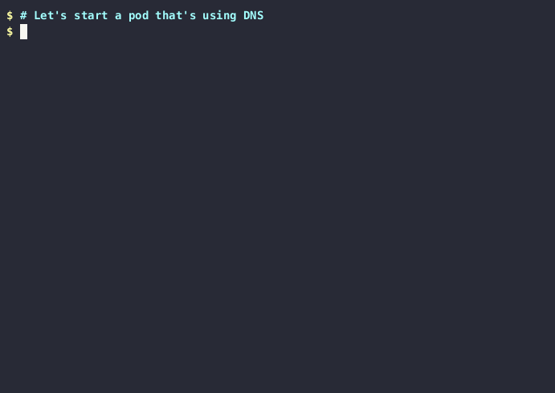

The trace dns gadget prints information about DNS queries and responses sent
and received by the different pods.

### On Kubernetes

Create a `demo` namespace:

```bash
$ kubectl create ns demo
namespace/demo created
```

Start the dns gadget:

```bash
$ kubectl gadget trace dns -n demo
K8S.NODE                      K8S.NAMESPACE                 K8S.PODNAME                   QR NAMESERVER      TYPE      QTYPE      NAME
```

Run a pod on a different terminal and perform some DNS requests:

```bash
$ kubectl -n demo run mypod -it --image=wbitt/network-multitool -- /bin/sh
# nslookup -querytype=a inspektor-gadget.io. 8.8.4.4
# nslookup -querytype=aaaa inspektor-gadget.io. 8.8.4.4
# nslookup -querytype=mx inspektor-gadget.io. 8.8.4.4
```

The requests will be logged by the DNS gadget:

```bash
K8S.NODE             K8S.NAMESPACE        K8S.PODNAME          PID         TID         COMM        QR NAMESERVER      TYPE      QTYPE      NAME                RCODE
minikube             demo                 mypod                1285309     1285310     isc-net-00… Q  8.8.4.4         OUTGOING  A          inspektor-gadget.i…
minikube             demo                 mypod                1285309     1285310     isc-net-00… R  8.8.4.4         HOST      A          inspektor-gadget.i… No Error
minikube             demo                 mypod                1285594     1285595     isc-net-00… Q  8.8.4.4         OUTGOING  AAAA       inspektor-gadget.i…
minikube             demo                 mypod                1285594     1285595     isc-net-00… R  8.8.4.4         HOST      AAAA       inspektor-gadget.i… No Error
minikube             demo                 mypod                1285655     1285656     isc-net-00… Q  8.8.4.4         OUTGOING  MX         inspektor-gadget.i…
minikube             demo                 mypod                1285655     1285656     isc-net-00… R  8.8.4.4         HOST      MX         inspektor-gadget.i… No Error
```

`isc-net-0000` is the name of one of the nslookup threads.

Delete the demo test namespace:

```bash
$ kubectl delete ns demo
namespace "demo" deleted
```

### With `ig`

Let's start the gadget in a terminal:

```bash
$ sudo ig trace dns -c test-trace-dns
RUNTIME.CONTAINERNAME                   PID        TID        COMM             QR TYPE      QTYPE      NAME                                   RCODE                NUMANSW…
```

Launch a container that makes DNS requests:

```bash
$ docker run --name test-trace-dns -it --rm wbitt/network-multitool /bin/sh
/ # nslookup -querytype=a inspektor-gadget.io. 8.8.4.4
...
/ # nslookup -querytype=aaaa inspektor-gadget.io. 8.8.4.4
...
/ # nslookup -querytype=mx inspektor-gadget.io. 8.8.4.4
...
```

The tool will list the different DNS queries that were made:

```bash
$ sudo ig trace dns -c test-trace-dns
RUNTIME.CONTAINERNAME                   PID        TID        COMM             QR TYPE      QTYPE      NAME                                   RCODE                NUMANSW…
test-trace-dns                          38797      38798      isc-net-0000     Q  OUTGOING  A          inspektor-gadget.io.                                        0
test-trace-dns                          38797      38798      isc-net-0000     R  HOST      A          inspektor-gadget.io.                   No Error             2
test-trace-dns                          38801      38802      isc-net-0000     Q  OUTGOING  AAAA       inspektor-gadget.io.                                        0
test-trace-dns                          38801      38802      isc-net-0000     R  HOST      AAAA       inspektor-gadget.io.                   No Error             2
test-trace-dns                          38807      38808      isc-net-0000     Q  OUTGOING  MX         inspektor-gadget.io.                                        0
test-trace-dns                          38807      38808      isc-net-0000     R  HOST      MX         inspektor-gadget.io.                   No Error             3
```

### Limitations

- Only DNS over UDP is supposed. See https://github.com/inspektor-gadget/inspektor-gadget/issues/1416.
