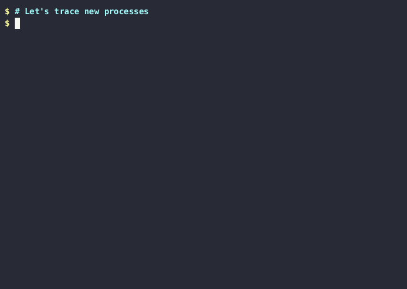

The trace exec gadget streams new processes creation events.

### On Kubernetes

Let's deploy an example application that will spawn few new processes:

```bash
$ kubectl apply -f https://raw.githubusercontent.com/inspektor-gadget/inspektor-gadget/main/docs/examples/ds-myapp.yaml
daemonset.apps/myapp1-pod created
daemonset.apps/myapp2-pod created

$ kubectl get pod --show-labels -o wide
NAME               READY   STATUS    RESTARTS   AGE   IP               NODE              NOMINATED NODE   READINESS GATES   LABELS
myapp1-pod-sbtvw   1/1     Running   0          9s    10.244.192.133   minikube-docker   <none>           <none>            controller-revision-hash=865c886d8f,myapp=app-one,name=myapp1-pod,pod-template-generation=1,role=demo
myapp2-pod-5pg4w   1/1     Running   0          9s    10.244.192.132   minikube-docker   <none>           <none>            controller-revision-hash=677d884fc,myapp=app-two,name=myapp2-pod,pod-template-generation=1,role=demo
```

Using the trace exec gadget, we can see which new processes are spawned on node
minikube-docker where myapp1-pod-sbtvw and myapp2-pod-5pg4w are running:

```bash
$ kubectl gadget trace exec --selector role=demo --node minikube-docker
K8S.NODE        K8S.NAMESPACE K8S.PODNAME      K8S.CONTAINER PID     PPID    COMM  PCOMM RET ARGS
minikube-docker default       myapp1-pod-sbtvw myapp1-pod    2226276 2221571 true  sh    0   /bin/true
minikube-docker default       myapp1-pod-sbtvw myapp1-pod    2226277 2221571 date  sh    0   /bin/date
minikube-docker default       myapp1-pod-sbtvw myapp1-pod    2226278 2221571 cat   sh    0   /bin/cat /proc/version
minikube-docker default       myapp1-pod-sbtvw myapp1-pod    2226279 2221571 true  sh    0   /bin/true
minikube-docker default       myapp1-pod-sbtvw myapp1-pod    2226280 2221571 date  sh    0   /bin/date
minikube-docker default       myapp1-pod-sbtvw myapp1-pod    2226281 2221571 cat   sh    0   /bin/cat /proc/version
minikube-docker default       myapp1-pod-sbtvw myapp1-pod    2226282 2221571 true  sh    0   /bin/true
minikube-docker default       myapp1-pod-sbtvw myapp1-pod    2226283 2221571 date  sh    0   /bin/date
minikube-docker default       myapp1-pod-sbtvw myapp1-pod    2226284 2221571 cat   sh    0   /bin/cat /proc/version
minikube-docker default       myapp1-pod-sbtvw myapp1-pod    2226286 2221571 true  sh    0   /bin/true
minikube-docker default       myapp1-pod-sbtvw myapp1-pod    2226287 2221571 date  sh    0   /bin/date
minikube-docker default       myapp1-pod-sbtvw myapp1-pod    2226288 2221571 cat   sh    0   /bin/cat /proc/version
minikube-docker default       myapp2-pod-5pg4w myapp2-pod    2226289 2221280 true  sh    0   /bin/true
minikube-docker default       myapp2-pod-5pg4w myapp2-pod    2226290 2221280 date  sh    0   /bin/date
minikube-docker default       myapp2-pod-5pg4w myapp2-pod    2226291 2221280 echo  sh    0   /bin/echo sleep-10
minikube-docker default       myapp2-pod-5pg4w myapp2-pod    2226292 2221280 sleep sh    0   /bin/sleep 10
^C
```
Processes of both pods are spawned: myapp1 spawns `cat /proc/version` and `sleep 1`,
myapp2 spawns `echo sleep-10` and `sleep 10`, both spawn `true` and `date`.
We can stop to trace again by hitting Ctrl-C.

Finally, we clean up our demo app.

```bash
$ kubectl delete -f https://raw.githubusercontent.com/inspektor-gadget/inspektor-gadget/main/docs/examples/ds-myapp.yaml
```

### With `ig`

Let's start the gadget in a terminal:

```bash
$ sudo ig trace exec -c test-trace-exec
RUNTIME.CONTAINERNAME PID     PPID    COMM   PCOMM           RET ARGS
```

Run a container that executes some binaries:

```bash
$ docker run --name test-trace-exec -it --rm busybox /bin/sh -c 'while /bin/true ; do whoami ; sleep 3 ; done'
```

The tool will show the different processes executed by the container:

```bash
$ sudo ig trace exec -c test-trace-exec
RUNTIME.CONTAINERNAME PID     PPID    COMM   PCOMM           RET ARGS
test-trace-exec       2233189 2233166 sh     containerd-shim 0   /bin/sh -c while /bin/true ; do whoami ; sleep 3 ; done
test-trace-exec       2233214 2233189 true   sh              0   /bin/true
test-trace-exec       2233215 2233189 whoami sh              0   /bin/whoami
test-trace-exec       2233567 2233189 true   sh              0   /bin/true
test-trace-exec       2233570 2233189 whoami sh              0   /bin/whoami
test-trace-exec       2233642 2233189 true   sh              0   /bin/true
test-trace-exec       2233643 2233189 whoami sh              0   /bin/whoami
test-trace-exec       2233757 2233189 true   sh              0   /bin/true
test-trace-exec       2233758 2233189 whoami sh              0   /bin/whoami
test-trace-exec       2233931 2233189 true   sh              0   /bin/true
test-trace-exec       2233932 2233189 whoami sh              0   /bin/whoami
```

### `--paths`

Optionally, this gadget can provide the current working directory of the process calling `exec()` and the full path of the executable.
This is disabled by default and can be enabled by passing the `--paths` flag:

```bash
$ sudo ig trace exec
RUNTIME.CONTAINERNAME PID    PPID   COMM  RET ARGS
test                  644871 639225 mkdir 0   /usr/bin/mkdir -p /tmp/bar/foo/
test                  644888 639225 cat   0   /usr/bin/cat /dev/null
```
```
$ sudo ig trace exec --paths
RUNTIME.CONTAINERN… PID    PPID   COMM  RET ARGS                     CWD EXEPATH
test                644377 639225 mkdir 0   /usr/bin/mkdir -p /tmp/… /   /usr/bin/mkdir
test                644497 639225 cat   0   /usr/bin/cat /dev/null   /   /usr/bin/cat
```


### Overlay filesystem upper layer

It can be useful to know if the executable, or its parent in the process
hierarchy, in a container was modified or part of the original container image.
If it was modified, it will be located in the upper layer of the overlay filesystem.
For this reason, this gadget provides the upper layer field which is true if the
executable is located in the upper layer of the overlay filesystem.

```bash
$ sudo ig trace exec -c test -o columns=comm,ret,upperlayer,pupperlayer
COMM             RET UPPERLAYER PUPPERLAYER
sh               0   false      false
cp               0   false      false
echo             0   false      false
echo2            0   true       false
cp               0   false      false
sh2              0   true       false
echo             0   false      true
```

```bash
$ docker run -ti --rm --name=test ubuntu \
    sh -c 'cp /bin/echo /bin/echo2 ; /bin/echo lower ; /bin/echo2 upper ; cp /bin/sh /bin/sh2 ; sh2 -c "/bin/echo pupper"'
lower
upper
pupper
```

Limitations:
- The upper layer field is only available when the executable is executed
 correctly (ret=0). For example, if the executable does not have the "execute"
 permission, the execution will fail and the upper layer field will not be
 defined.
- In case of a shell script, the upper layer field will refer to the location
 of the shell program (e.g. `/bin/sh`) and not the script file.
