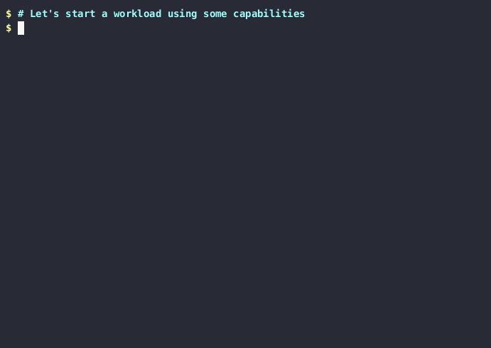

The trace capabilities gadget allows us to see what capability security checks
are triggered by applications running in Kubernetes Pods.

Linux [capabilities](https://man7.org/linux/man-pages/man7/capabilities.7.html) allow for a finer
privilege control because they can give root-like capabilities to processes without giving them full
root access. They can also be taken away from root processes. If a pod is directly executing
programs as root, we can further lock it down by taking capabilities away. Sometimes we need to add
capabilities which are not there by default. You can see the list of default and available
capabilities [in
Docker](https://docs.docker.com/engine/reference/run/#runtime-privilege-and-linux-capabilities).
Specially if our pod is directly run as user instead of root (runAsUser: ID), we can give some more
capabilities (think as partly root) and still take all unused capabilities to really lock it down.

### On Kubernetes

Here we have a small demo app which logs failures due to lacking capabilities.
Since none of the default capabilities is dropped, we have to find
out what non-default capability we have to add.

```bash
$ cat docs/examples/app-set-priority.yaml
apiVersion: apps/v1
kind: Deployment
metadata:
  name: set-priority
  labels:
    k8s-app: set-priority
spec:
  selector:
    matchLabels:
      name: set-priority
  template:
    metadata:
      labels:
        name: set-priority
    spec:
      containers:
      - name: set-priority
        image: busybox
        command: [ "sh", "-c", "while /bin/true ; do nice -n -20 echo ; sleep 5; done" ]

$ kubectl apply -f docs/examples/app-set-priority.yaml
deployment.apps/set-priority created
$ kubectl logs -lname=set-priority
nice: setpriority(-20): Permission denied
nice: setpriority(-20): Permission denied
```

We could see the error messages in the pod's log.
Let's use Inspektor Gadget to watch the capability checks:

```bash
$ kubectl gadget trace capabilities --selector name=set-priority
K8S.NODE         K8S.NAMESPACE  K8S.POD                 K8S.CONTAINER PID      COMM  SYSCALL      UID  CAP CAPNAME   AUDIT  VERDICT
minikube-docker  default        set-priorit…495c8-t88x8 set-priority  2711127  nice  setpriority  0    23  SYS_NICE  1      Deny
minikube-docker  default        set-priorit…495c8-t88x8 set-priority  2711260  nice  setpriority  0    23  SYS_NICE  1      Deny
minikube-docker  default        set-priorit…495c8-t88x8 set-priority  2711457  nice  setpriority  0    23  SYS_NICE  1      Deny
minikube-docker  default        set-priorit…495c8-t88x8 set-priority  2711619  nice  setpriority  0    23  SYS_NICE  1      Deny
minikube-docker  default        set-priorit…495c8-t88x8 set-priority  2711815  nice  setpriority  0    23  SYS_NICE  1      Deny
^C
Terminating...
```

We can leave the gadget with Ctrl-C.
In the output we see that the `SYS_NICE` capability got checked when `nice` was run.
We should probably add it to our pod template for `nice` to work. We can also drop
all other capabilities from the default list (see link above) since `nice`
did not use them:

The meaning of the columns is:

* `SYSCALL`: the system call that caused the capability to be exercised
* `CAP`: capability number
* `CAPNAME`: capability name in a human friendly format
* `AUDIT`: whether the kernel should audit the security request or not
* `VERDICT`: whether the capability was present (allow) or not (deny)

```bash
$ cat docs/examples/app-set-priority-locked-down.yaml
apiVersion: apps/v1
kind: Deployment
metadata:
  name: set-priority
  labels:
    k8s-app: set-priority
spec:
  selector:
    matchLabels:
      name: set-priority
  template:
    metadata:
      labels:
        name: set-priority
    spec:
      containers:
      - name: set-priority
        image: busybox
        command: [ "sh", "-c", "while /bin/true ; do nice -n -20 echo ; sleep 5; done" ]
        securityContext:
          capabilities:
            add: ["SYS_NICE"]
            drop: [all]

```

Let's verify that our locked-down version works.

```bash
$ kubectl delete -f docs/examples/app-set-priority.yaml
deployment.apps "set-priority" deleted
$ kubectl apply -f docs/examples/app-set-priority-locked-down.yaml
deployment.apps/set-priority created
$ kubectl logs -lname=set-priority

```

The logs are clean, so everything works!

We can see the same checks but this time with the `Allow` verdict:

```bash
$ kubectl gadget trace capabilities --selector name=set-priority
K8S.NODE         K8S.NAMESPACE  K8S.POD                 K8S.CONTAINER PID      COMM  SYSCALL      UID  CAP CAPNAME   AUDIT  VERDICT
minikube-docker  default        set-priorit…66dff-nm5pt set-priority  2718069  nice  setpriority  0    23  SYS_NICE  1      Allow
minikube-docker  default        set-priorit…66dff-nm5pt set-priority  2718291  nice  setpriority  0    23  SYS_NICE  1      Allow
^C
Terminating...
```

You can now delete the pod you created:
```
$ kubectl delete -f docs/examples/app-set-priority-locked-down.yaml
```

#### Interpreting advanced columns

Some columns are not displayed by default:
* `caps`: the effective capability bitfield of the process
* `capsnames`: same as caps in a human friendly format
* `currentuserns`: the user namespace of the process
* `targetuserns`: the user namespace that the kernel used to test the
  capability.

They can be useful to understand advanced usage of capabilities.
Let's see two examples.

```
$ kubectl run -ti --rm --restart=Never \
    --image busybox --privileged testcaps -- \
    chroot /
```

```
$ kubectl gadget trace capabilities \
    -o columns=comm,syscall,capName,verdict,targetuserns,currentuserns,caps,capsnames
COMM             SYSCALL                      CAPNAME            VERDICT TARGETUSERNS        CURRENTUSERNS       CAPS                 CAPSNAMES
chroot           chroot                       SYS_CHROOT         Allow   4026531837          4026531837          3fffffffff           chown,dac_override,dac_…
```

In this example, targetuserns and currentuserns are the same. This is
necessarily the case for chroot because the kernel tests the capability
in this way:
```
if (!ns_capable(current_user_ns(), CAP_SYS_CHROOT))
```

The effective capability bitfield is "3fffffffff".
This can be decoded in this way:
```shell
$ capsh --decode=3fffffffff
0x0000003fffffffff=cap_chown,cap_dac_override,cap_dac_read_search,cap_fowner,cap_fsetid,cap_kill,cap_setgid,cap_setuid,cap_setpcap,cap_linux_immutable,cap_net_bind_service,cap_net_broadcast,cap_net_admin,cap_net_raw,cap_ipc_lock,cap_ipc_owner,cap_sys_module,cap_sys_rawio,cap_sys_chroot,cap_sys_ptrace,cap_sys_pacct,cap_sys_admin,cap_sys_boot,cap_sys_nice,cap_sys_resource,cap_sys_time,cap_sys_tty_config,cap_mknod,cap_lease,cap_audit_write,cap_audit_control,cap_setfcap,cap_mac_override,cap_mac_admin,cap_syslog,cap_wake_alarm,cap_block_suspend,cap_audit_read
```

The effective capability set includes `CAP_SYS_CHROOT` and targetuserns and currentuserns are the same.
Hence the verdict "Allow".

It is also possible to see the list of capabilities in json:

```
$ kubectl gadget trace capabilities -o json | jq .
{
  "node": "minikube-docker",
  "namespace": "default",
  "pod": "testcaps",
  "container": "testcaps",
  "timestamp": 1677087968732237745,
  "type": "normal",
  "mountnsid": 4026533307,
  "pid": 3277678,
  "comm": "chroot",
  "syscall": "chroot",
  "uid": 0,
  "gid": 0,
  "cap": 18,
  "capName": "SYS_CHROOT",
  "audit": 1,
  "verdict": "Allow",
  "insetid": false,
  "targetuserns": 4026531837,
  "currentuserns": 4026531837,
  "caps": 274877906943,
  "capsNames": [
    ...
    "sys_rawio",
    "sys_chroot",
    "sys_ptrace",
    ...
  ]
}
```

In the next example, we will create a new user namespace but without creating a new mount namespace.
We will then attempt to create a new mount:

```
$ kubectl run -ti --rm --restart=Never \
    --image busybox --privileged testcaps -- \
    /bin/unshare -Urf /bin/mount -t tmpfs tmpfs /tmp
```

Let's have a look at the generated logs for the mount process:

```
$ kubectl gadget trace capabilities -o json | jq .
{
  "node": "minikube-docker",
  "namespace": "default",
  "pod": "testcaps",
  "container": "testcaps",
  "timestamp": 1677088257998618652,
  "type": "normal",
  "mountnsid": 4026533307,
  "pid": 3287538,
  "comm": "mount",
  "syscall": "mount",
  "uid": 0,
  "gid": 0,
  "cap": 21,
  "capName": "SYS_ADMIN",
  "audit": 1,
  "verdict": "Deny",
  "insetid": false,
  "targetuserns": 4026531837,
  "currentuserns": 4026533310,
  "caps": 2199023255551,
  "capsNames": [
    ...
    "sys_pacct",
    "sys_admin",
    "sys_boot",
    ...
  ]
}
```

The capability set includes `CAP_SYS_ADMIN`.
However, the verdict is "Deny".

This can be explained by the interaction with user namespaces.
The target and current user namespaces are different. This makes a difference
because the kernel tests the capability with regard to the user
namespaces owning the mount namespace, that is the parent user namespace:
```
if (!ns_capable(mnt_ns->user_ns, CAP_SYS_ADMIN) || ...
```

### With `ig`

Start `ig`:

```bash
$ ig trace capabilities -r docker -c test
RUNTIME.CONTAINERNAME  PID      COMM     SYSCALL  UID  CAP CAPNAME      AUDIT  VERDICT
```

Start the test container exercising the capabilities:
```bash
$ docker run -ti --rm --name=test --privileged busybox
/ # touch /aaa ; chown 1:1 /aaa ; chmod 400 /aaa
/ # chroot /
/ # mkdir /mnt ; mount -t tmpfs tmpfs /mnt
/ # export PPID=$$;/bin/unshare -i sh -c "/bin/nsenter -i -t $PPID echo OK"
OK
```

Observe the resulting trace:

```
RUNTIME.CONTAINERNAME  PID      COMM     SYSCALL  UID  CAP CAPNAME      AUDIT  VERDICT
test                   2609137  chown    chown    0    0   CHOWN        1      Allow
test                   2609137  chown    chown    0    0   CHOWN        1      Allow
test                   2609138  chmod    chmod    0    3   FOWNER       1      Allow
test                   2609138  chmod    chmod    0    4   FSETID       1      Allow
test                   2609138  chmod    chmod    0    4   FSETID       1      Allow
test                   2609694  chroot   chroot   0    18  SYS_CHROOT   1      Allow
test                   2610364  mount    mount    0    21  SYS_ADMIN    1      Allow
test                   2610364  mount    mount    0    21  SYS_ADMIN    1      Allow
test                   2633270  unshare  unshare  0    21  SYS_ADMIN    1      Allow
test                   2633270  nsenter  setns    0    21  SYS_ADMIN    1      Allow
test                   2633270  nsenter  setns    0    21  SYS_ADMIN    1      Allow
```
