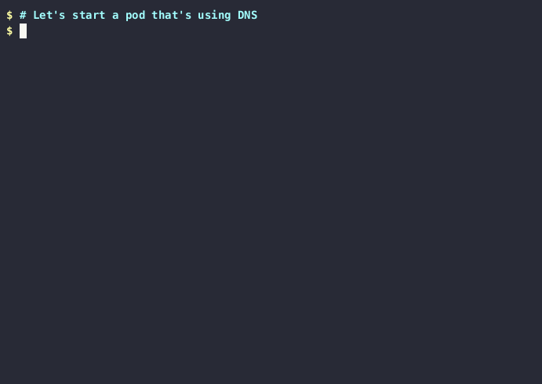

The trace dns gadget prints information about DNS queries and responses sent
and received by the different pods.

Create a `demo` namespace:

```bash
$ kubectl create ns demo
namespace/demo created
```

Start the dns gadget:

```bash
$ kubectl gadget trace dns -n demo
NODE                          NAMESPACE                     POD                           QR NAMESERVER      TYPE      QTYPE      NAME
```

Run a pod on a different terminal and perform some DNS requests:

```bash
$ kubectl -n demo run mypod -it --image=wbitt/network-multitool -- /bin/sh
# nslookup -querytype=a inspektor-gadget.io. 8.8.4.4
# nslookup -querytype=aaaa inspektor-gadget.io. 8.8.4.4
# nslookup -querytype=mx inspektor-gadget.io. 8.8.4.4
```

The requests will be logged by the DNS gadget:

```bash
NODE                 NAMESPACE            POD                  QR NAMESERVER      TYPE      QTYPE       NAME                RCODE
minikube             demo                 mypod                Q  8.8.4.4         OUTGOING  A           inspektor-gadget.i…
minikube             demo                 mypod                R  8.8.4.4         HOST      A           inspektor-gadget.i… NoError
minikube             demo                 mypod                Q  8.8.4.4         OUTGOING  AAAA        inspektor-gadget.i…
minikube             demo                 mypod                R  8.8.4.4         HOST      AAAA        inspektor-gadget.i… NoError
minikube             demo                 mypod                Q  8.8.4.4         OUTGOING  MX          inspektor-gadget.i…
minikube             demo                 mypod                R  8.8.4.4         HOST      MX          inspektor-gadget.i… NoError
```

Delete the demo test namespace:

```bash
$ kubectl delete ns demo
namespace "demo" deleted
```
