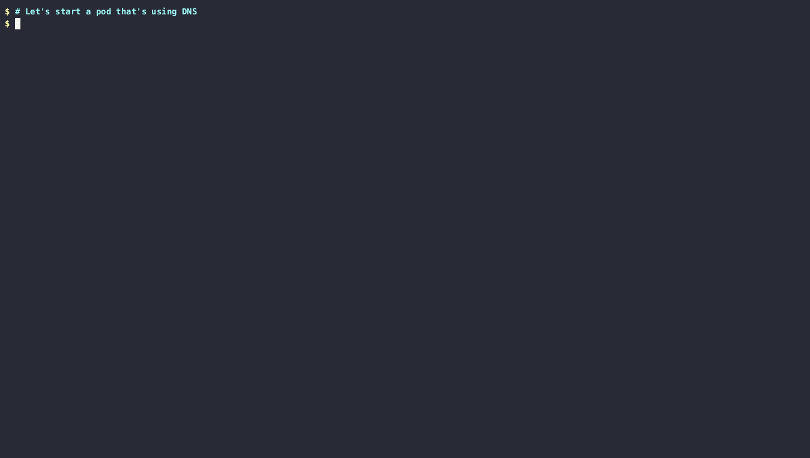

The trace dns gadget prints information about DNS requests performed by the different
pods.

Create a `demo` namespace:

```bash
$ kubectl create ns demo
namespace/demo created
```

Start the dns gadget:

```bash
$ kubectl gadget trace dns -n demo
NODE             NAMESPACE        POD              TYPE      QTYPE      NAME
```

Run a pod on a different terminal and perform some DNS requests:

```bash
$ kubectl -n demo run mypod -it --image=wbitt/network-multitool -- /bin/sh
# nslookup www.microsoft.com
# nslookup www.google.com
# nslookup www.amazon.com
```

The requests will be logged by the DNS gadget:

```bash
NODE             NAMESPACE        POD              TYPE      QTYPE      NAME
minikube         demo             mypod            OUTGOING  A          www.microsoft.com.demo.svc.cluster.local.
minikube         demo             mypod            OUTGOING  A          www.microsoft.com.svc.cluster.local.
minikube         demo             mypod            OUTGOING  A          www.microsoft.com.cluster.local.
minikube         demo             mypod            OUTGOING  A          www.microsoft.com.
minikube         demo             mypod            OUTGOING  AAAA       e13678.dscb.akamaiedge.net.
minikube         demo             mypod            OUTGOING  A          www.google.com.demo.svc.cluster.local.
minikube         demo             mypod            OUTGOING  A          www.google.com.svc.cluster.local.
minikube         demo             mypod            OUTGOING  A          www.google.com.cluster.local.
minikube         demo             mypod            OUTGOING  A          www.google.com.
minikube         demo             mypod            OUTGOING  AAAA       www.google.com.
minikube         demo             mypod            OUTGOING  A          www.amazon.com.demo.svc.cluster.local.
minikube         demo             mypod            OUTGOING  A          www.amazon.com.svc.cluster.local.
minikube         demo             mypod            OUTGOING  A          www.amazon.com.cluster.local.
minikube         demo             mypod            OUTGOING  A          www.amazon.com.
minikube         demo             mypod            OUTGOING  AAAA       e15316.a.akamaiedge.net.
```

Delete the demo test namespace:

```bash
$ kubectl delete ns demo
namespace "demo" deleted
```
