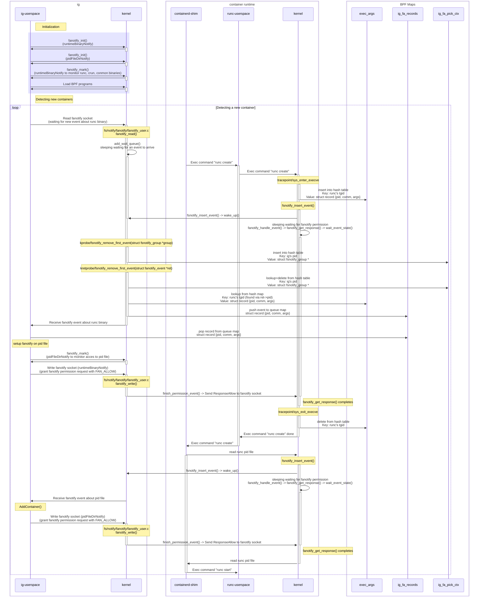

```mermaid
sequenceDiagram
    box ig
        participant ig-userspace
        participant ig-kernel as kernel
    end
    box container runtime
        participant containerd-shim
        participant runc-userspace
        participant runc-kernel as kernel
    end
    box BPF Maps
        participant exec_args
        participant ig_fa_records
        participant ig_fa_pick_ctx
    end

    Note right of ig-userspace: Initialization
    rect rgba(0, 0, 255, .1)
    ig-userspace ->> + ig-kernel: fanotify_init()<br>(runtimeBinaryNotify)
    ig-kernel ->> - ig-userspace: 
    ig-userspace ->> + ig-kernel: fanotify_init()<br>(pidFileDirNotify)
    ig-kernel ->> - ig-userspace: 
    ig-userspace ->> + ig-kernel: fanotify_mark()<br>(runtimeBinaryNotify to monitor runc, crun, conmon binaries)
    ig-kernel ->> - ig-userspace: 
    ig-userspace ->> + ig-kernel: Load BPF programs
    ig-kernel ->> - ig-userspace: 
    end

    Note right of ig-userspace: Detecting new containers
    Loop Detecting a new container
    ig-userspace ->> + ig-kernel: Read fanotify socket<br>(waiting for new event about runc binary)
    Note over ig-kernel: fs/notify/fanotify/fanotify_user.c<br>fanotify_read()
    
    ig-kernel ->> + ig-kernel: add_wait_queue()<br>sleeping waiting for an event to arrive

    containerd-shim ->> + runc-userspace: Exec command "runc create"
    runc-userspace ->> + runc-kernel: Exec command "runc create"
    Note over runc-kernel: tracepoint/sys_enter_execve
    Activate runc-kernel
    runc-kernel ->> exec_args: insert into hash table<br/>Key: runc's tgid<br/>Value: struct record {pid, comm, args}
    Deactivate runc-kernel

    Note over runc-kernel: fsnotify_insert_event()
    Activate runc-kernel
    runc-kernel ->> ig-kernel: fsnotify_insert_event() -> wake_up()
    Deactivate ig-kernel
    runc-kernel ->> runc-kernel: sleeping waiting for fanotify permission<br>fanotify_handle_event() -> fanotify_get_response() -> wait_event_state()
    Activate runc-kernel
  
    Note over ig-kernel: kprobe/fsnotify_remove_first_event(struct fsnotify_group *group)
    Activate ig-kernel

    ig-kernel ->> ig_fa_pick_ctx: insert into hash table<br/>Key: ig's pid<br/>Value: struct fsnotify_group *
    Deactivate ig-kernel
    Note over ig-kernel: kretprobe/fsnotify_remove_first_event(struct fanotify_event *ret)
    Activate ig-kernel
    ig-kernel ->> ig_fa_pick_ctx: lookup+delete from hash table<br/>Key: ig's pid<br/>Value: struct fsnotify_group *
    ig-kernel ->> exec_args: lookup from hash map<br>Key: runc's tgid (found via ret->pid)<br/>Value: struct record {pid, comm, args}
    ig-kernel ->> ig_fa_records: push event to queue map<br>struct record {pid, comm, args}
    Deactivate ig-kernel
    ig-kernel ->> - ig-userspace: Receive fanotify event about runc binary
    ig-userspace ->> ig_fa_records: pop record from queue map<br>struct record {pid, comm, args}

    Note over ig-userspace: setup fanotify on pid file
    ig-userspace ->> + ig-kernel: fanotify_mark()<br>(pidFileDirNotify to monitor acces to pid file)
    ig-kernel ->> - ig-userspace: 

    ig-userspace ->> + ig-kernel: Write fanotify socket (runtimeBinaryNotify)<br>(grant fanotify permission request with FAN_ALLOW)
    Note over ig-kernel: fs/notify/fanotify/fanotify_user.c<br>fanotify_write()
    ig-kernel ->> runc-kernel: finish_permission_event() -> Send ResponseAllow to fanotify socket
    Deactivate ig-kernel
    Deactivate runc-kernel
    Note right of runc-kernel: fanotify_get_response() completes
    
    Deactivate runc-kernel
    Note over runc-kernel: tracepoint/sys_exit_execve
    Activate runc-kernel
    runc-kernel ->> exec_args: delete from hash table<br/>Key: runc's tgid
    Deactivate runc-kernel
    runc-kernel ->> - runc-userspace: Exec command "runc create" done

    runc-userspace ->> - containerd-shim: Exec command "runc create"

    containerd-shim ->> + runc-kernel: read runc pid file
    Activate containerd-shim

    Note over runc-kernel: fsnotify_insert_event()
    Activate runc-kernel
    runc-kernel ->> ig-kernel: fsnotify_insert_event() -> wake_up()
    %%Deactivate ig-kernel
    runc-kernel ->> runc-kernel: sleeping waiting for fanotify permission<br>fanotify_handle_event() -> fanotify_get_response() -> wait_event_state()
    Activate runc-kernel
    ig-kernel ->> ig-userspace: Receive fanotify event about pid file

    Note over ig-userspace: AddContainer()

    ig-userspace ->> + ig-kernel: Write fanotify socket (pidFileDirNotify)<br>(grant fanotify permission request with FAN_ALLOW)
    Note over ig-kernel: fs/notify/fanotify/fanotify_user.c<br>fanotify_write()
    ig-kernel ->> runc-kernel: finish_permission_event() -> Send ResponseAllow to fanotify socket
    Deactivate ig-kernel
    Deactivate runc-kernel
    Note right of runc-kernel: fanotify_get_response() completes

    runc-kernel ->> - containerd-shim: read runc pid file

    containerd-shim ->> + runc-userspace: Exec command "runc start"

    Deactivate containerd-shim
    
    end
```
