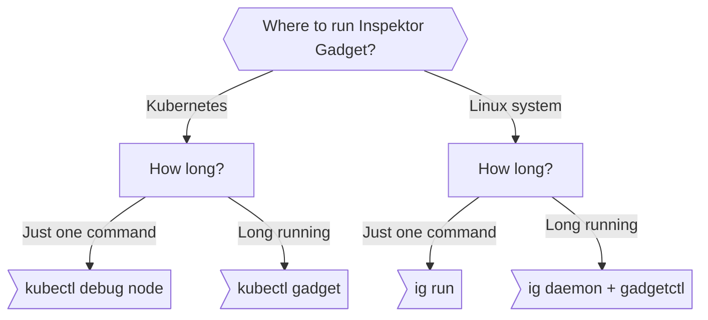

Inspektor Gadget can be used either on a Linux machine or on Kubernetes. It
supports both ephemeral commands and permanent installation.



<!-- markdown-link-check-disable-next-line -->
The following examples use the [trace_open](./gadgets/trace_open) Gadget which triggers when a file is open on the system.

### Kubernetes

#### Deployed to the Cluster

[krew](https://sigs.k8s.io/krew) is the recommended way to install
`kubectl gadget`. You can follow the
[krew's quickstart](https://krew.sigs.k8s.io/docs/user-guide/quickstart/)
to install it and then install `kubectl gadget` by executing the following
commands.

```bash
kubectl krew install gadget
kubectl gadget deploy
kubectl gadget run trace_open:latest
```

Check [Installing on Kubernetes](./reference/install-kubernetes.md) to learn more about different options.

#### Kubectl Node Debug

We can use [kubectl node debug](https://kubernetes.io/docs/tasks/debug/debug-cluster/kubectl-node-debug/) to run `ig` on a Kubernetes node:

```bash
kubectl debug --profile=sysadmin node/minikube-docker -ti --image=ghcr.io/inspektor-gadget/ig -- ig run trace_open:latest
```

For more information on how to use `ig` without installation on Kubernetes, please refer to the [ig documentation](./reference/ig.md#using-ig-with-kubectl-debug-node).

### Linux

#### Install Locally

Install the `ig` binary locally on Linux and run a Gadget:

```bash
IG_ARCH=amd64
IG_VERSION=$(curl -s https://api.github.com/repos/inspektor-gadget/inspektor-gadget/releases/latest | jq -r .tag_name)

curl -sL https://github.com/inspektor-gadget/inspektor-gadget/releases/download/${IG_VERSION}/ig-linux-${IG_ARCH}-${IG_VERSION}.tar.gz | sudo tar -C /usr/local/bin -xzf - ig

sudo ig run trace_open:latest
```

Check [Installing on Linux](./reference/install-linux.md) to learn more.

#### Run in a Container

```bash
docker run -ti --rm --privileged -v /:/host --pid=host ghcr.io/inspektor-gadget/ig run trace_open:latest
```

For more information on how to use `ig` without installation on Linux, please check [Using ig in a container](./reference/ig.md#using-ig-in-a-container).

### MacOS or Windows

It's possible to control an `ig` running in Linux from different operating systems by using the `gadgetctl` binary.

Run the following on a Linux machine to make `ig` available to clients.

```bash
sudo ig daemon --host=tcp://0.0.0.0:1234
```

Download the `gadgetctl` tools for MacOS
([amd64](https://github.com/inspektor-gadget/inspektor-gadget/releases/download/v0.30.0/gadgetctl-darwin-amd64-v0.30.0.tar.gz),
[arm64](https://github.com/inspektor-gadget/inspektor-gadget/releases/download/v0.30.0/gadgetctl-darwin-arm64-v0.30.0.tar.gz)) or [windows](https://github.com/inspektor-gadget/inspektor-gadget/releases/download/v0.30.0/gadgetctl-windows-amd64-v0.30.0.tar.gz) and run the Gadget specifying the IP address of the Linux machine:


```bash
gadgetctl run trace_open:latest --remote-address=tcp://$IP:1234
```

***The above demonstrates the simplest command. To learn how to filter, export, etc. please consult the documentation for the [run](./reference/run.mdx) command***.
