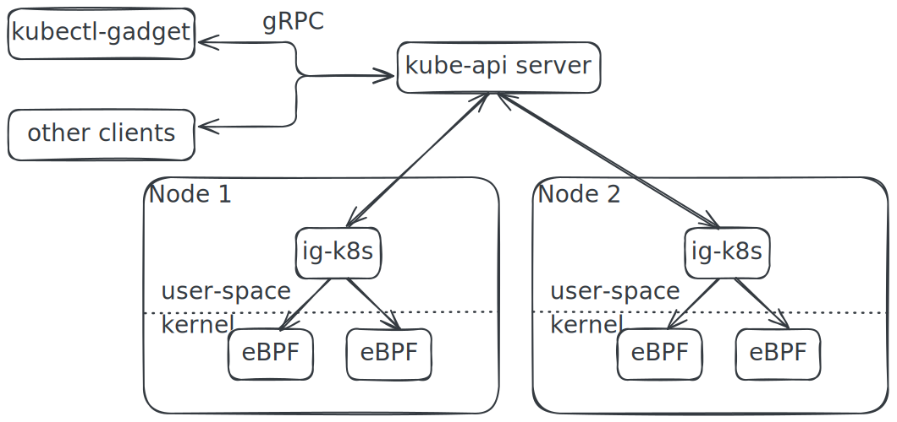
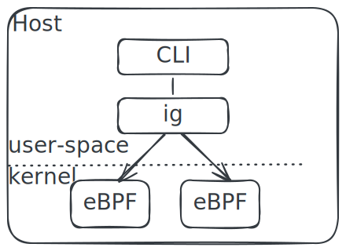
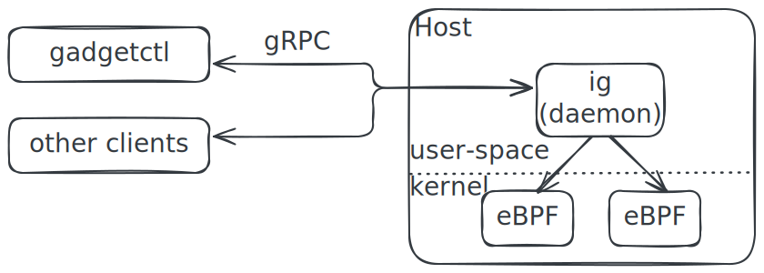

:::warning

This document is work in progress

:::

Inspektor Gadget handles the execution of Gadgets, it fetches the Gadget image
from an OCI registry, loads the eBPF programs in the kernel and handles the data
they provide.

## On Kubernetes

Inspektor Gadget is deployed as a DaemonSet in Kubernetes, i.e. there is one
Inspektor Gadget pod per each node in the cluster. This pod is on charge of
loading the eBPF programs in the kernel, fetching the data they produce and
enriching that with information available on the node (like container name, pod
name etc.) and finally sending the data to the client. Clients (like kubectl
gadget) control Inspektor Gadget by using gRPC connection through the kube-api
server.

## On Local Host

The architecture on the local host is very similar to the previous one, the only
difference is that the `ig` binary can provide the information locally or send
it through a gRPC connection when running as a daemon.

### Locally

### `ig` as daemon

