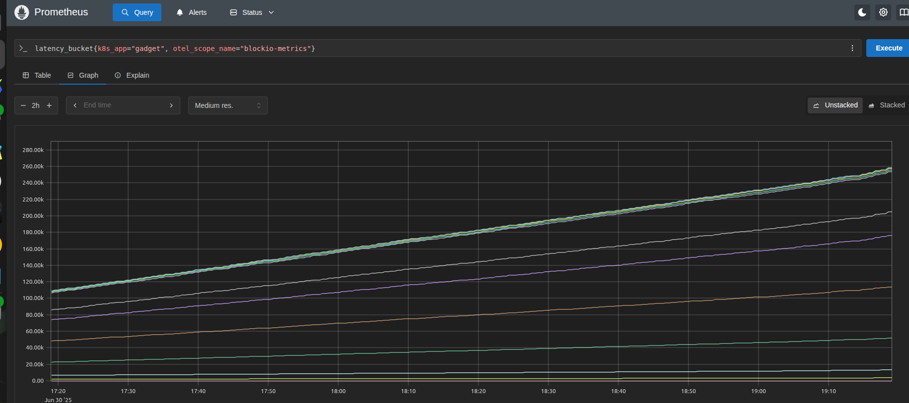

import Tabs from '@theme/Tabs';
import TabItem from '@theme/TabItem';

Inspektor Gadget supports exporting metrics to Prometheus using the [metrics
exporter](https://opentelemetry.io/docs/specs/otel/metrics/sdk_exporters/prometheus/).
In order to do so, you need to [enable the metrics
listener & optionally specify the metrics exporter port](#enabling-the-metrics-listener),  and [configure each gadget to actively
expose its metrics](#enabling-export-for-gadgets).

## Enabling the metrics listener

In order to enable the metrics listener, you need to set the
`otel-metrics-listen` parameter to `true` and optionally specify
the `otel-metrics-listen-address` parameter to define the address
and port where the metrics will be exposed.:

<Tabs groupId="env">
    <TabItem value="kubectl-gadget" label="kubectl gadget">
        ```bash
        kubectl gadget deploy --otel-metrics-listen=true --otel-metrics-listen-address=0.0.0.0:9091
        ```
    </TabItem>

    <TabItem value="ig" label="ig">
        ```bash
        sudo ig daemon --otel-metrics-listen=true --otel-metrics-listen-address=0.0.0.0:9091
        ```
    </TabItem>
</Tabs>

If the `otel-metrics-listen-address` is not specified, the default address is 0.0.0.0:2224.

## Enabling export for gadgets

Some gadgets have the ability to export metrics. The *Exporting metrics* section
of the gadget's documentation will tell you whether or not the gadget exports
metrics and, in case, what metrics it exports. The
[profile_blockio](../gadgets/profile_blockio#exporting-metrics) gadget is an
example of a gadget that exports metrics.

:::note

If you're developing your own gadget, you can add metrics to it by following the
instructions in the [Adding Metrics to your Gadget](../gadget-devel/metrics)
guide.

:::

Now, in order to enable the export of metrics for a gadget, you need to do the
following:

- Annotate the data source with `metrics.collect=true`: This tells the gadget to
  collect and export metrics for this data source.
- Specify a unique metrics name for the data source using the
  `--otel-metrics-name datasource:metricsname` flag: This is required even if
  `datasource` and `metricsname` are the same. This makes sure that you don't
  export metrics by accident and thereby skew existing data as the `metricsname`
  will be the used as the
  [otel-scope](https://opentelemetry.io/docs/concepts/instrumentation-scope/).
- [Optional] If you are only interested in exporting metrics and not displaying
  them in the CLI, you can use the `--detach` flag to run the gadget in
  [headless mode](./headless.mdx).

Following is an example of how to enable metrics export for the
`profile_blockio` gadget:

<Tabs groupId="env">
    <TabItem value="kubectl-gadget" label="kubectl gadget">
        ```bash
        kubectl gadget run ghcr.io/inspektor-gadget/gadget/profile_blockio:%IG_TAG% \
                    --name profileblockio \
                    --annotate=blockio:metrics.collect=true \
                    --otel-metrics-name=blockio:blockio-metrics \
                    --detach
        ```
    </TabItem>

    <TabItem value="ig" label="ig">
        ```bash
        gadgetctl run ghcr.io/inspektor-gadget/gadget/profile_blockio:%IG_TAG% \
                    --name profileblockio \
                    --annotate=blockio:metrics.collect=true \
                    --otel-metrics-name=blockio:blockio-metrics \
                    --detach
        ```
    </TabItem>
</Tabs>

## Viewing metrics

Once you have enabled the metrics listener and configured the gadgets to export
metrics, you can query the metrics using Prometheus. By default, the metrics
will be available at `http://0.0.0.0:2224/metrics`. You can change this address
by setting the `otel-metrics-listen-address` parameter. In the examples below
the port 9091 will be used for exporting metrics. In which case the metrics will
be available at `http://0.0.0.0:9091/metrics`.

Metrics will be available under the `metricsname` you specified when enabling
the metrics export for the gadget. For example, under `blockio-metrics` for the
`profile_blockio` gadget we ran above:

<Tabs groupId="env">
    <TabItem value="kubectl-gadget" label="kubectl gadget">
        ```bash
        $ export POD_NAME=$(kubectl get pods -n gadget -o jsonpath="{.items[0].metadata.name}")
        $ kubectl -n gadget port-forward $POD_NAME 9091:9091 &
        $ curl http://localhost:9091/metrics -s | grep blockio-metrics
        latency_bucket{otel_scope_name="blockio-metrics",otel_scope_version="",le="1"} 0
        latency_bucket{otel_scope_name="blockio-metrics",otel_scope_version="",le="2"} 0
        latency_bucket{otel_scope_name="blockio-metrics",otel_scope_version="",le="4"} 0
        latency_bucket{otel_scope_name="blockio-metrics",otel_scope_version="",le="8"} 4347
        latency_bucket{otel_scope_name="blockio-metrics",otel_scope_version="",le="16"} 11534
        latency_bucket{otel_scope_name="blockio-metrics",otel_scope_version="",le="32"} 17621
        latency_bucket{otel_scope_name="blockio-metrics",otel_scope_version="",le="64"} 23856
        latency_bucket{otel_scope_name="blockio-metrics",otel_scope_version="",le="128"} 34452
        latency_bucket{otel_scope_name="blockio-metrics",otel_scope_version="",le="256"} 37677
        latency_bucket{otel_scope_name="blockio-metrics",otel_scope_version="",le="512"} 37812
        latency_bucket{otel_scope_name="blockio-metrics",otel_scope_version="",le="1024"} 37876
        latency_bucket{otel_scope_name="blockio-metrics",otel_scope_version="",le="2048"} 37882
        latency_bucket{otel_scope_name="blockio-metrics",otel_scope_version="",le="4096"} 37891
        latency_bucket{otel_scope_name="blockio-metrics",otel_scope_version="",le="8192"} 37891
        latency_bucket{otel_scope_name="blockio-metrics",otel_scope_version="",le="16384"} 37891
        latency_bucket{otel_scope_name="blockio-metrics",otel_scope_version="",le="32768"} 37891
        latency_bucket{otel_scope_name="blockio-metrics",otel_scope_version="",le="65536"} 37891
        latency_bucket{otel_scope_name="blockio-metrics",otel_scope_version="",le="131072"} 37891
        latency_bucket{otel_scope_name="blockio-metrics",otel_scope_version="",le="262144"} 37891
        latency_bucket{otel_scope_name="blockio-metrics",otel_scope_version="",le="524288"} 37891
        latency_bucket{otel_scope_name="blockio-metrics",otel_scope_version="",le="1.048576e+06"} 37891
        latency_bucket{otel_scope_name="blockio-metrics",otel_scope_version="",le="2.097152e+06"} 37891
        latency_bucket{otel_scope_name="blockio-metrics",otel_scope_version="",le="4.194304e+06"} 37891
        latency_bucket{otel_scope_name="blockio-metrics",otel_scope_version="",le="8.388608e+06"} 37891
        latency_bucket{otel_scope_name="blockio-metrics",otel_scope_version="",le="1.6777216e+07"} 37891
        latency_bucket{otel_scope_name="blockio-metrics",otel_scope_version="",le="3.3554432e+07"} 37891
        latency_bucket{otel_scope_name="blockio-metrics",otel_scope_version="",le="6.7108864e+07"} 37891
        latency_bucket{otel_scope_name="blockio-metrics",otel_scope_version="",le="+Inf"} 37891
        latency_sum{otel_scope_name="blockio-metrics",otel_scope_version=""} 3.109288e+06
        latency_count{otel_scope_name="blockio-metrics",otel_scope_version=""} 37891
        otel_scope_info{otel_scope_name="blockio-metrics",otel_scope_version=""} 1
        ```
    </TabItem>

    <TabItem value="ig" label="ig">
        ```bash
        $ curl http://localhost:9091/metrics -s | grep blockio-metrics
        latency_bucket{otel_scope_name="blockio-metrics",otel_scope_version="",le="1"} 0
        latency_bucket{otel_scope_name="blockio-metrics",otel_scope_version="",le="2"} 0
        latency_bucket{otel_scope_name="blockio-metrics",otel_scope_version="",le="4"} 0
        latency_bucket{otel_scope_name="blockio-metrics",otel_scope_version="",le="8"} 10
        latency_bucket{otel_scope_name="blockio-metrics",otel_scope_version="",le="16"} 193
        latency_bucket{otel_scope_name="blockio-metrics",otel_scope_version="",le="32"} 374
        latency_bucket{otel_scope_name="blockio-metrics",otel_scope_version="",le="64"} 943
        latency_bucket{otel_scope_name="blockio-metrics",otel_scope_version="",le="128"} 1825
        latency_bucket{otel_scope_name="blockio-metrics",otel_scope_version="",le="256"} 2829
        latency_bucket{otel_scope_name="blockio-metrics",otel_scope_version="",le="512"} 3905
        latency_bucket{otel_scope_name="blockio-metrics",otel_scope_version="",le="1024"} 4280
        latency_bucket{otel_scope_name="blockio-metrics",otel_scope_version="",le="2048"} 4351
        latency_bucket{otel_scope_name="blockio-metrics",otel_scope_version="",le="4096"} 4351
        latency_bucket{otel_scope_name="blockio-metrics",otel_scope_version="",le="8192"} 4354
        latency_bucket{otel_scope_name="blockio-metrics",otel_scope_version="",le="16384"} 4354
        latency_bucket{otel_scope_name="blockio-metrics",otel_scope_version="",le="32768"} 4354
        latency_bucket{otel_scope_name="blockio-metrics",otel_scope_version="",le="65536"} 4354
        latency_bucket{otel_scope_name="blockio-metrics",otel_scope_version="",le="131072"} 4354
        latency_bucket{otel_scope_name="blockio-metrics",otel_scope_version="",le="262144"} 4354
        latency_bucket{otel_scope_name="blockio-metrics",otel_scope_version="",le="524288"} 4354
        latency_bucket{otel_scope_name="blockio-metrics",otel_scope_version="",le="1.048576e+06"} 4354
        latency_bucket{otel_scope_name="blockio-metrics",otel_scope_version="",le="2.097152e+06"} 4354
        latency_bucket{otel_scope_name="blockio-metrics",otel_scope_version="",le="4.194304e+06"} 4354
        latency_bucket{otel_scope_name="blockio-metrics",otel_scope_version="",le="8.388608e+06"} 4354
        latency_bucket{otel_scope_name="blockio-metrics",otel_scope_version="",le="1.6777216e+07"} 4354
        latency_bucket{otel_scope_name="blockio-metrics",otel_scope_version="",le="3.3554432e+07"} 4354
        latency_bucket{otel_scope_name="blockio-metrics",otel_scope_version="",le="6.7108864e+07"} 4354
        latency_bucket{otel_scope_name="blockio-metrics",otel_scope_version="",le="+Inf"} 4354
        latency_sum{otel_scope_name="blockio-metrics",otel_scope_version=""} 1.520032e+06
        latency_count{otel_scope_name="blockio-metrics",otel_scope_version=""} 4354
        otel_scope_info{otel_scope_name="blockio-metrics",otel_scope_version=""} 1
        ```
    </TabItem>
</Tabs>

### Viewing metrics with Prometheus
#### Prometheus Configuration
If you have a Prometheus server running, you can configure it to scrape the metrics from the exposed port. The following
is an example scrape configuration for Prometheus. The configuration file for Prometheus is usually named
`prometheus.yml`. The following can used as a basis for your configuration file.

```yaml

global:
  scrape_interval: 15s
  evaluation_interval: 15s

scrape_configs:
  - job_name: "gadgets"
    static_configs:
      - targets: ['localhost:9091']
        labels:
          app: "blockio"
```
#### Running the prometheus server
Prometheus can be run both within a kubernetes cluster and outside of it. There are various advantages and disadvantages
to both. Running externally means that resources within the cluster are not used. If multiple clusters are being monitored,
then running prometheus externally may be a better option. However, this does require the metrics to be exposed
externally.


Once you have your configuration file ready, you can run prometheus either within your cluster or outside of it.

In the examples below there are three options shown the external, internal & internal via minikube service. The internal
services are deployed to the cluster using helm charts. The external service is run outside of the cluster. In all
cases the configuration file is used to configure prometheus to scrape the metrics from the gadgets exporter which is
being configured to run on port 9091.

<Tabs groupId="env">
    <TabItem value="external" label="External">
        - [Prometheus server installation instructions](https://prometheus.io/docs/introduction/first_steps/#downloading-prometheus)
        ```bash
        prometheus --config.file=prometheus.yml
        ```
        In a separate terminal tab the the prometheus metrics port can be forwarded to localhost
        ```bash
        export POD_NAME=$(k get pods -n gadget -o jsonpath="{.items[0].metadata.name}")
        kubectl -n gadget port-forward $POD_NAME 9091:9091
        ```
    </TabItem>
    <TabItem value="internal" label="Internal">
        - [Installation instructions for helm](https://helm.sh/docs/intro/install/)
        - [Installation instructions for prometheus helm chart](https://github.com/prometheus-community/helm-charts)
        ```bash
        kubectl create configmap prometheus-config --from-file=prometheus.yml
        helm install prometheus prometheus-community/prometheus \
          --set serverFiles.prometheus.yml.configMapName=prometheus-config
        kubectl expose service prometheus-server --type=NodePort \
          --target-port=9090 --name=prometheus-server-ext
        echo "Prometheus server is available at:"
        echo "http://$(kubectl get nodes -o jsonpath="{.items[0].status.addresses[?(@.type=='InternalIP')].address}"):$(kubectl get service prometheus-server-ext -o jsonpath="{.spec.ports[0].nodePort}")"
        ```
    </TabItem>
    <TabItem value="minikube" label="Internal Minikube">
        - [Installation instructions for helm](https://helm.sh/docs/intro/install/)
        - [Installation instructions for prometheus helm chart](https://github.com/prometheus-community/helm-charts)
        ```bash
        kubectl create configmap prometheus-config --from-file=prometheus.yml
        helm install prometheus prometheus-community/prometheus \
          --set serverFiles.prometheus.yml.configMapName=prometheus-config
        kubectl expose service prometheus-server --type=NodePort \
          --target-port=9090 --name=prometheus-server-ext
        minikube service prometheus-server-ext
        ```
    </TabItem>
</Tabs>

#### Viewing the metrics in Prometheus
You can then view the metrics in the Prometheus web UI. The URL will vary depending on the way you choose to host your
prometheus service.  For the externally hosted service the URL would be `http://localhost:9090/`. For prometheus services
hosted internally to a cluster the URL will be variable. You can use the following queries to view the metrics in the
prometheus graph tab:

```
latency_bucket{k8s_app="gadget", otel_scope_name="blockio-metrics"}
```
This shows a histogram from the blockio-metrics gadget.




Prometheus has its own [query language](https://prometheus.io/docs/prometheus/latest/querying/basics/) that you can use to filter and aggregate metrics. Prometheus has several
types of metric types that can be emitted. The most common ones are:

- **[Counter](https://prometheus.io/docs/concepts/metric_types/#counter)**: A counter is a cumulative metric that represents a single monotonically increasing counter whose value can only increase or be reset to zero on restart. For example, the `latency_count` metric in the example above is a counter that counts the number of latency measurements taken.
- **[Gauge](https://prometheus.io/docs/concepts/metric_types/#gauge)**: A gauge is a metric that represents a single numerical value that can arbitrarily go up and down. For example, the `memory_usage` metric in the example above is a gauge that measures the current memory usage of the gadget.
- **[Histogram](https://prometheus.io/docs/concepts/metric_types/#histogram)**: A histogram samples observations (usually things like request durations or response sizes) and counts them in configurable buckets. It also provides a sum of all observed values. For example, the `latency_bucket` metric in the example above is a histogram that measures the latency of block I/O operations.


## Stopping metrics collection

You can stop the metrics collection at any time by deleting the gadget instance:

<Tabs groupId="env">
    <TabItem value="kubectl-gadget" label="kubectl gadget">
        ```bash
        $ kubectl gadget delete profileblockio
        ```
    </TabItem>

    <TabItem value="ig" label="ig">
        ```bash
        $ gadgetctl delete profileblockio
        ```
    </TabItem>
</Tabs>

## Other Exporters

If you have more complex requirements for metric exporting, you can setup multiple exporters using the
config file. In this section we're exploring other exporters.

### OTLP-gRPC

In order to setup an exporter using [OTLP](https://opentelemetry.io/docs/specs/otel/metrics/sdk_exporters/otlp/) over
gRPC, you can add the following section to your config file:

```yaml
operator:
  otel-metrics:
    exporters:
      myexporter:
        exporter: otlp-grpc
        endpoint: "localhost:4317"
        insecure: true
        temporality: delta
        interval: 30s
        collectGoMetrics: false
        collectIGMetrics: false
```

This will add a new exporter named "myexporter" that can be selected by using the flag
`--otel-metrics-exporter myexporter` when running a gadget. `exporter` needs to be set to `otlp-grpc` and you at least
need to configure an `endpoint`.

#### Insecure

This boolean flag determines whether to use encryption when communicating with the server.

#### Temporality

Can be `cumulative` (default) or `delta`. See the
[official documentation](https://opentelemetry.io/docs/specs/otel/metrics/sdk_exporters/otlp/) for more information.

#### Interval

Interval in which to report metrics to the server.

#### collectGoMetrics

Enable collecting/exporting internal Go metrics. These are exposed by the Go programming language (that IG is written in)
and contain a set of performance and usage metrics.

#### collectIGMetrics

Enable collecting/exporting internal Inspektor Gadget metrics.
