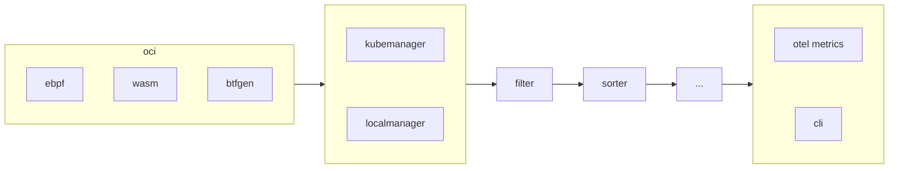

import DocCardList from '@theme/DocCardList';

Operators are the cornerstones of the Inspektor Gadget architecture. They are
modular components implementing the same interfaces
([1](https://pkg.go.dev/github.com/inspektor-gadget/inspektor-gadget@v0.31.0/pkg/operators#DataOperator),
[2](https://pkg.go.dev/github.com/inspektor-gadget/inspektor-gadget@v0.31.0/pkg/operators#ImageOperator)).
They are responsible for specific tasks, such as loading eBPF programs,
enriching events, sorting output, etc. All operators can generate, drop or
manipulate data and few of them handle the
[layers](../../oci.md#image-layers-and-media-types) of gadget OCI image.

Operators are arranged in a pipeline according to their priority:

Operators are enabled automatically based on the gadget that's being run,
according to the layers present on the OCI image, the types used by the eBPF
programs, etc. It's currently [not
possible](https://github.com/inspektor-gadget/inspektor-gadget/issues/1992) to
explicitly disable an operator. Also, all operators are currently built-in, [we
however plan](https://github.com/inspektor-gadget/inspektor-gadget/issues/2497)
to support third-party operators in the future.

## Parameters

Operators expose parameters to control them. There are two kinds of parameters:

### Global

These parameters have a global scope and can only be set on the server part when
[deploying](../../reference/architecture.md#on-kubernetes) Inspektor Gadget in Kubernetes,
running it as a [daemon](../../reference/architecture.md#ig-as-daemon) or running it
[locally](../../reference/architecture.md#locally). It means, these paremeters aren't
available to users running gadgetctl or kubectl-gadget. They are intended to
control sensitive things like security configuration that can only be set by the
system administrator.

### Instance

These parameters can be set each time a gadget is run and only have impact on
the gadget being run.

Parameters are passed as flags when [running](../../reference/run.mdx) a gadget
using the CLI tools (kubectl-gadget / gadgetctl / ig). When using the
[APIs](../../apis), it's required to use the full qualified name.

## Available Operators

<DocCardList />
