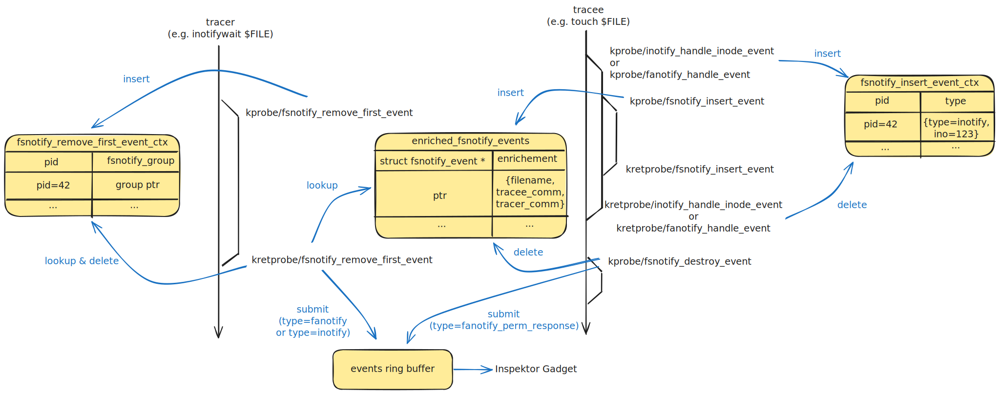

import Tabs from '@theme/Tabs';
import TabItem from '@theme/TabItem';

# fsnotify

The fsnotify gadget detects applications using inotify or fanotify and enriches the events with the process-related metadata.

## Getting started

Running the gadget:

<Tabs groupId="env">
    <TabItem value="kubectl-gadget" label="kubectl gadget">
        ```bash
        $ kubectl gadget run ghcr.io/inspektor-gadget/gadget/fsnotify:latest [flags]
        ```
    </TabItem>

    <TabItem value="ig" label="ig">
        ```bash
        $ sudo ig run ghcr.io/inspektor-gadget/gadget/fsnotify:latest [flags]
        ```
    </TabItem>
</Tabs>
## Flags

### `--fanotify-only`

Show only fanotify events

Default value: ""

### `--inotify-only`

Show only inotify events

Default value: ""

### `--tracee-pid`

Show only fsnotify events generated by processes with this pid

Default value: ""

### `--tracer-group`

Show only fsnotify events generated by a struct fsnotify_group with this address. You can find this address in Golang with kfilefields.ReadPrivateDataFromFd(). See https://pkg.go.dev/github.com/inspektor-gadget/inspektor-gadget/pkg/kfilefields#ReadPrivateDataFromFd

Default value: ""

### `--tracer-pid`

Show only fsnotify events generated for processes with this pid

Default value: ""

## Guide

### Example with inotify

Start an application using inotify:
```bash
inotifywatch /tmp/
```

You can generate events in another terminal with:
```bash
touch /tmp/ABCDE
```

The fsnotify gadget can observe and enrich the inotify events in the following way:
```bash
$ sudo ig run ghcr.io/inspektor-gadget/gadget/fsnotify:latest --inotify-only --fields=tracer_comm,tracee_comm,i_mask,name
TRACER_COMM    TRACEE_COMM   I_MASK      NAME
inotifywatch   touch         0x8000020   ABCDE
inotifywatch   touch         0x8000004   ABCDE
inotifywatch   touch         0x8000008   ABCDE
```

The mask uses the same flags as inotify (`IN_ACCESS`, etc.) + some internal ones:
```bash
134217760 = 0x08000020 = FS_OPEN | FS_EVENT_ON_CHILD
134217732 = 0x08000004 = FS_ATTRIB | FS_EVENT_ON_CHILD
134217736 = 0x08000008 = FS_CLOSE_WRITE | FS_EVENT_ON_CHILD
```

### Example with fanotify

ig itself uses fanotify to watch containers. You can generate events in another terminal with:
```bash
docker run -ti --rm busybox date
```

The fsnotify gadget can observe and enrich the fanotify events in the following way:
```bash
$ sudo ig run ghcr.io/inspektor-gadget/gadget/fsnotify:latest --fanotify-only --fields=tracer_comm,tracee_comm,type,fa_type,fa_response,name
TRACER_COMM  TRACEE_COMM      TYPE       FA_TYPE                         FA_RESPONSE   NAME
ig           containerd-shim  fanotify   FANOTIFY_EVENT_TYPE_PATH_PERM   na            /usr/bin/runc
ig           containerd-shim  fa_resp    FANOTIFY_EVENT_TYPE_PATH_PERM   allow         /usr/bin/runc
ig           containerd-shim  fanotify   FANOTIFY_EVENT_TYPE_PATH_PERM   na            /run/containerd/io.containerd.runtime.v2.task/mob…
ig           containerd-shim  fa_resp    FANOTIFY_EVENT_TYPE_PATH_PERM   allow         /run/containerd/io.containerd.runtime.v2.task/mob…
ig           containerd-shim  fanotify   FANOTIFY_EVENT_TYPE_PATH_PERM   na            /usr/bin/runc
ig           containerd-shim  fa_resp    FANOTIFY_EVENT_TYPE_PATH_PERM   allow         /usr/bin/runc
ig           containerd-shim  fanotify   FANOTIFY_EVENT_TYPE_PATH_PERM   na            /usr/bin/runc
ig           containerd-shim  fa_resp    FANOTIFY_EVENT_TYPE_PATH_PERM   allow         /usr/bin/runc
ig           containerd-shim  fanotify   FANOTIFY_EVENT_TYPE_PATH_PERM   na            /usr/bin/runc
ig           containerd-shim  fa_resp    FANOTIFY_EVENT_TYPE_PATH_PERM   allow         /usr/bin/runc
```

## Architecture


