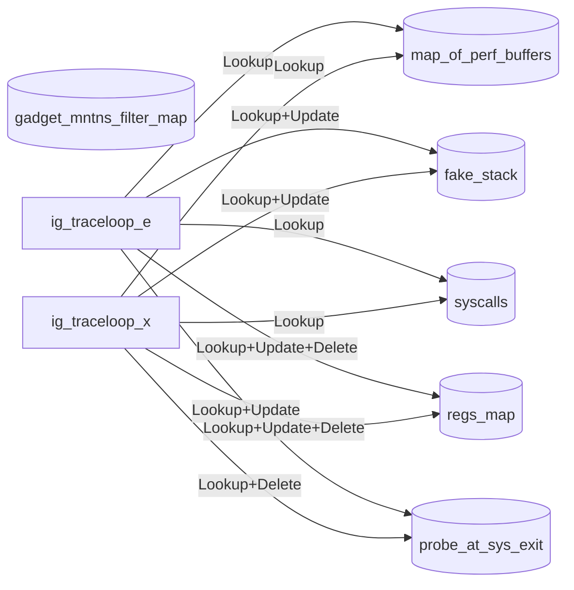
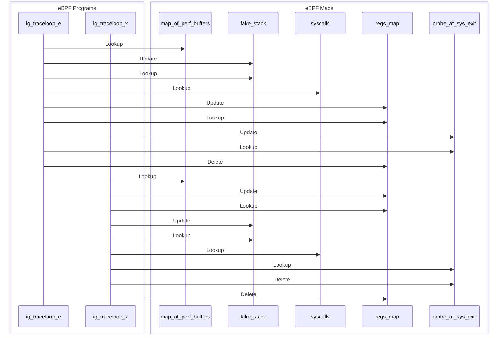

# Developer Notes

This file complements the README file with implementation details specific to this gadget. It includes diagrams that illustrate how eBPF programs interact with eBPF maps. These visualizations help clarify the internal data flow and logic, making it easier to understand, maintain, and extend the gadget.

## Program-Map interactions

The following diagrams are generated using the `ig image inspect` command. Note they are a best-effort representation of the actual interactions, as they do not account for conditionals in the code that may prevent certain program–map interactions from occurring at runtime.

### Flowchart

### Sequence Diagram

