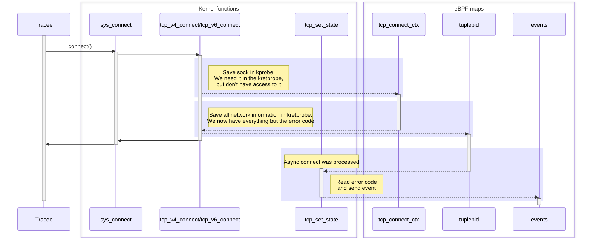

import Tabs from '@theme/Tabs';
import TabItem from '@theme/TabItem';

# trace_tcp

The trace_tcp gadget tracks tcp connect, accept and close.

## Getting started

Running the gadget:

<Tabs groupId="env">
    <TabItem value="kubectl-gadget" label="kubectl gadget">
        ```bash
        $ kubectl gadget run ghcr.io/inspektor-gadget/gadget/trace_tcp:%IG_TAG% [flags]
        ```
    </TabItem>

    <TabItem value="ig" label="ig">
        ```bash
        $ sudo ig run ghcr.io/inspektor-gadget/gadget/trace_tcp:%IG_TAG% [flags]
        ```
    </TabItem>
</Tabs>
## Flags

### `--pid`

Show only events generated by processes with this pid

Default value: ""

### `--uid`

Show only events generated by processes with this uid

Default value: ""

### `--connect-only`

Show only connect events

Default value: ""

## Guide

<Tabs groupId="env">
    <TabItem value="kubectl-gadget" label="kubectl gadget">
        First, we need to create one pod:

        ```bash
        $ kubectl run bb --image busybox:latest sleep inf
        pod/bb created
        ```

        You can now use the gadget, but output will be empty:

        ```bash
        $ kubectl gadget run trace_tcp:%IG_TAG%
        K8S.NODE          K8S.NAMESPACE         K8S.PODNAME           K8S.CONTAINERNAME     SRC                          DST                          COMM                PID         TID         UID        GID TYPE
        ```

        Indeed, it is waiting for TCP connection to be established in the `default` namespace (you can use `-A` to monitor all namespaces and then be sure to not miss any event).
        So, in *another terminal*, `exec` a container and run this `wget`:

        ```bash
        $ kubectl exec -ti bb -- wget https://www.kinvolk.io
        Connecting to www.kinvolk.io (188.114.96.3:443)
        wget: note: TLS certificate validation not implemented
        saving to 'index.html'
        index.html           100% |************************************************************************************************| 47748  0:00:00 ETA
        'index.html' saved
        ```

        Go back to the terminal where the gadget is running. The requests will be logged by the gadget:

        ```bash
        K8S.NODE          K8S.NAMESPACE         K8S.PODNAME           K8S.CONTAINERNAME     SRC                          DST                          COMM                PID         TID         UID        GID TYPE
        minikube-docker   default               bb                    bb                    p/default/bb:60552           172.67.196.142:443           wget             750625      750625           0          0 connect
        ```
    </TabItem>

    <TabItem value="ig" label="ig">
        Start the gadget in a terminal:

        ```bash
        $ sudo ig run trace_tcp:%IG_TAG% --containername test-trae-tcp
        RUNTIME.CONTAINERNAME        SRC                                   DST                                   COMM                        PID            TID            UID            GID TYPE
        ```

        Then, run a container that creates a TCP connection.

        ```bash
        $ docker run -it --name test-trace-tcp busybox /bin/sh -c "wget https://www.example.com"
        Connecting to www.example.com (93.184.216.34:443)
        wget: note: TLS certificate validation not implemented
        saving to 'index.html'
        index.html           100% |********************************|  1256  0:00:00 ETA
        'index.html' saved
        ```

        The gadget will print that connection on the first terminal

        ```bash
        $ sudo ig trace tcp -c test-trace-tcp
        RUNTIME.CONTAINERNAME        SRC                                   DST                                   COMM                        PID            TID            UID            GID TYPE
        test-trace-tcp               172.17.0.2:39664                      93.184.215.14:443                     wget                     757178         757178              0              0 connect
        ```
    </TabItem>
</Tabs>

The printed lines correspond to TCP connection established with the socket.

Congratulations! You reached the end of this guide!
You can now delete the pod you created:

<Tabs groupId="env">
    <TabItem value="kubectl-gadget" label="kubectl gadget">
        ```bash
        $ kubectl delete pod bb
        ```
    </TabItem>

    <TabItem value="ig" label="ig">
        ```bash
        $ docker rm -f test-trace-tcp
        ```
    </TabItem>
</Tabs>

## Architecture

### `connect`

This diagram shows the path for asynchronous tcp connect calls. For synchronous one the `tcp_set_state` path is done before `sys_connect` returns back to the `Tracee`


