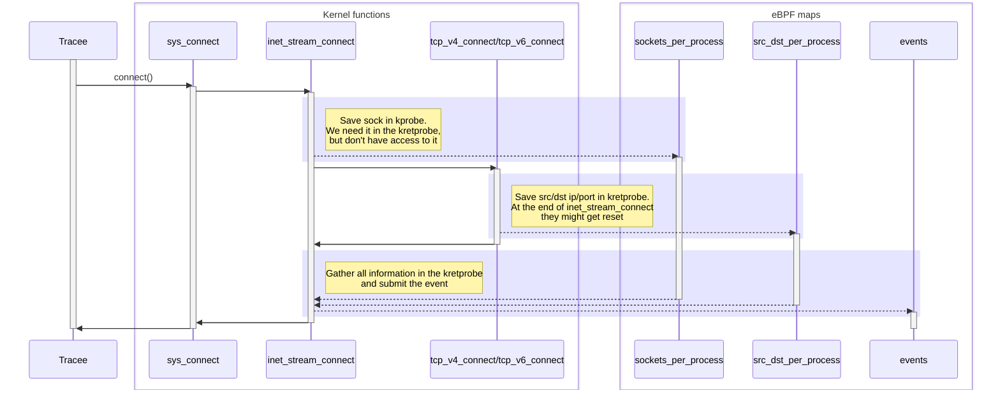

import Tabs from '@theme/Tabs';
import TabItem from '@theme/TabItem';

# trace_tcpconnect

This gadget traces outgoing TCP connect attempts initiated through the `connect` system call.
For non-blocking sockets ([O_NONBLOCK](https://man7.org/linux/man-pages/man7/socket.7.html)), the connection attempt is handled asynchronously.
In these cases, the error field may not reflect the final result of the connection attempt but may instead show `115`/`EINPROGRESS`, indicating that the attempt has been initiated but is not yet complete.

## Getting started

Running the gadget:

<Tabs groupId="env">
    <TabItem value="kubectl-gadget" label="kubectl gadget">
        ```bash
        $ kubectl gadget run ghcr.io/inspektor-gadget/gadget/trace_tcpconnect:%IG_TAG% [flags]
        ```
    </TabItem>

    <TabItem value="ig" label="ig">
        ```bash
        $ sudo ig run ghcr.io/inspektor-gadget/gadget/trace_tcpconnect:%IG_TAG% [flags]
        ```
    </TabItem>
</Tabs>

## Flags

No flags.

## Guide

Create an interactive test workload in another terminal:

<Tabs groupId="env">
    <TabItem value="kubectl-gadget" label="kubectl gadget">
        ```bash
        $ kubectl run --rm -it --image busybox test-trace-tcpconnect
        ```
    </TabItem>

    <TabItem value="ig" label="ig">
        ```bash
        $ docker run --rm -it --name test-trace-tcpconnect busybox'
        ```
    </TabItem>
</Tabs>

Then, let's run the gadget and trace some events:

<Tabs groupId="env">
    <TabItem value="kubectl-gadget" label="kubectl gadget">
        ```bash
        $ kubectl-gadget run trace_tcpconnect:%IG_TAG% --containername test-trace-tcpconnect
        ```
    </TabItem>

    <TabItem value="ig" label="ig">
        ```bash
        $ sudo ig run trace_tcpconnect:%IG_TAG% --containername test-trace-tcpconnect
        ```
    </TabItem>
</Tabs>

To generate some event we go back to our test workload, which we created earlier, and use `wget` on some hosts:

```bash
$ wget www.inspektor-gadget.io
$ wget 192.168.1.1
```

Now we should see some events in the terminal where the gadget is running:

<Tabs groupId="env">
    <TabItem value="kubectl-gadget" label="kubectl gadget">
        ```bash
        K8S.NODE          K8S.NAMESPACE     K8S.PODNAME       K8S.CONTAINERNAME SRC                     DST                     COMM            PID       TID      UID      GID ERROR 
        minikube-docker   default           test-tra…pconnect test-trace-tcpcon 10.244.0.5:33152        188.114.96.3:80         wget         104183    104183        0        0       
        minikube-docker   default           test-tra…pconnect test-trace-tcpcon 10.244.0.5:44394        188.114.96.3:443        wget         104183    104183        0        0       
        minikube-docker   default           test-tra…pconnect test-trace-tcpcon 10.244.0.5:46028        192.168.1.1:80          wget         104997    104997        0        0 ECONNR
        ^C
        ```
    </TabItem>

    <TabItem value="ig" label="ig">
        ```bash
        RUNTIME.CONTAINERNAME        SRC                                   DST                                   COMM                  PID        TID        UID        GID ERROR     
        test-trace-tcpconnect        172.17.0.2:53208                      188.114.96.3:80                       wget                40138      40138          0          0           
        test-trace-tcpconnect        172.17.0.2:56386                      188.114.96.3:443                      wget                40138      40138          0          0           
        test-trace-tcpconnect        172.17.0.2:50946                      192.168.1.1:80                        wget                40697      40697          0          0 ECONNREFUS
        ^C
        ```
    </TabItem>
</Tabs>

Finally, to clean the system we switch back to the test workload and exit out of it:
```bash
$ exit
```

## Architecture


