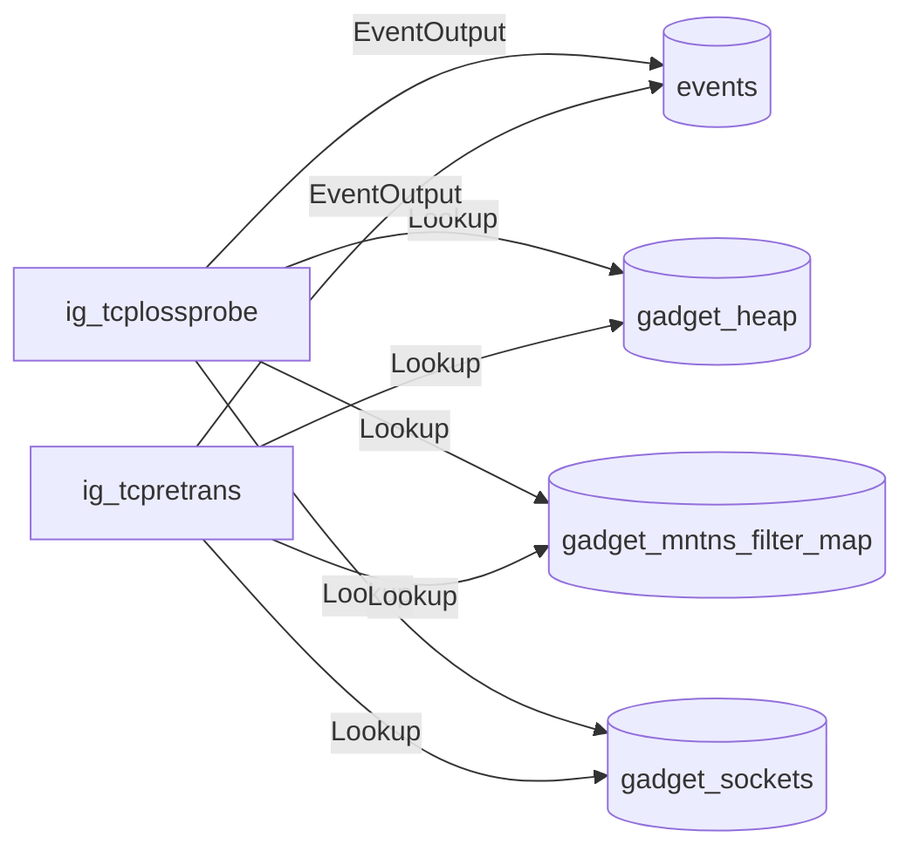
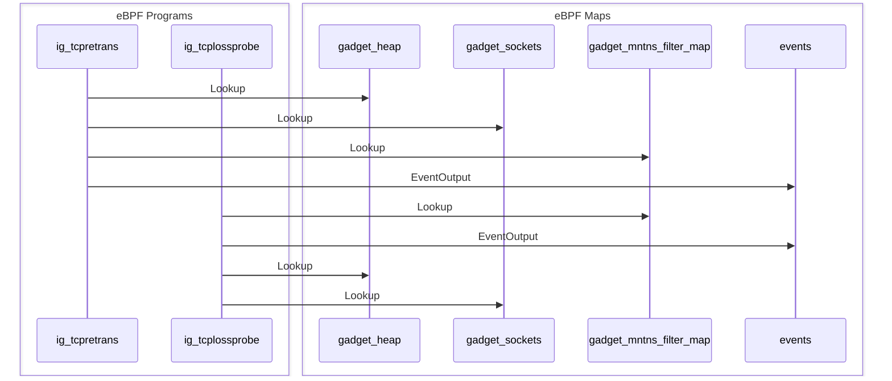

## Program-Map Relationships

### Flowchart Graph

```mermaid
flowchart LR
events[("events")]
gadget_heap[("gadget_heap")]
gadget_mntns_filter_map[("gadget_mntns_filter_map")]
gadget_sockets[("gadget_sockets")]
ig_tcplossprobe -- "EventOutput" --> events
ig_tcplossprobe -- "Lookup" --> gadget_heap
ig_tcplossprobe -- "Lookup" --> gadget_mntns_filter_map
ig_tcplossprobe -- "Lookup" --> gadget_sockets
ig_tcplossprobe["ig_tcplossprobe"]
ig_tcpretrans -- "EventOutput" --> events
ig_tcpretrans -- "Lookup" --> gadget_heap
ig_tcpretrans -- "Lookup" --> gadget_mntns_filter_map
ig_tcpretrans -- "Lookup" --> gadget_sockets
ig_tcpretrans["ig_tcpretrans"]
```

### Sequence Graph 

```mermaid
sequenceDiagram
box eBPF Programs
participant ig_tcpretrans
participant ig_tcplossprobe
end
box eBPF Maps
participant gadget_heap
participant gadget_sockets
participant gadget_mntns_filter_map
participant events
end
ig_tcpretrans->>gadget_heap: Lookup
ig_tcpretrans->>gadget_sockets: Lookup
ig_tcpretrans->>gadget_mntns_filter_map: Lookup
ig_tcpretrans->>events: EventOutput
ig_tcplossprobe->>gadget_mntns_filter_map: Lookup
ig_tcplossprobe->>events: EventOutput
ig_tcplossprobe->>gadget_heap: Lookup
ig_tcplossprobe->>gadget_sockets: Lookup
```
